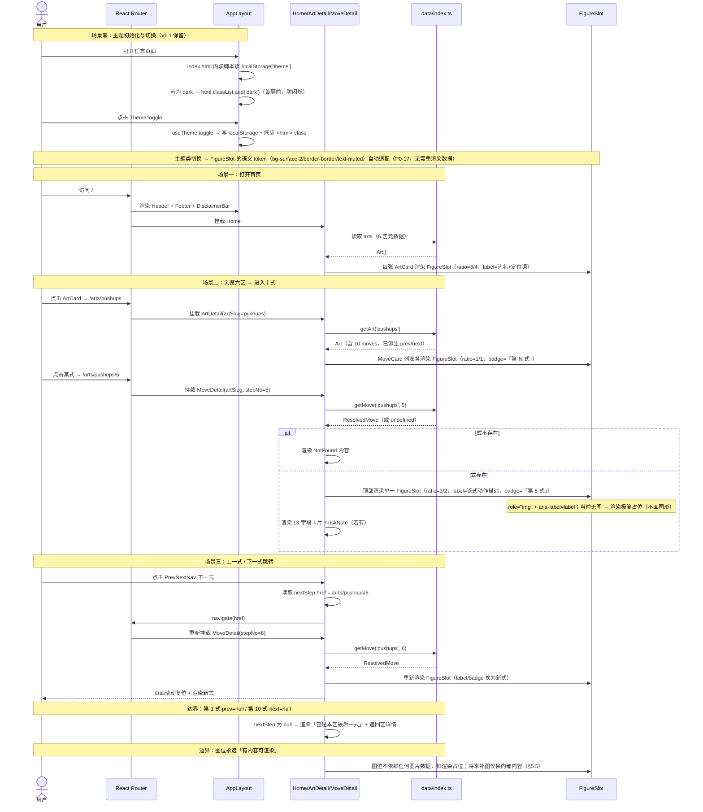
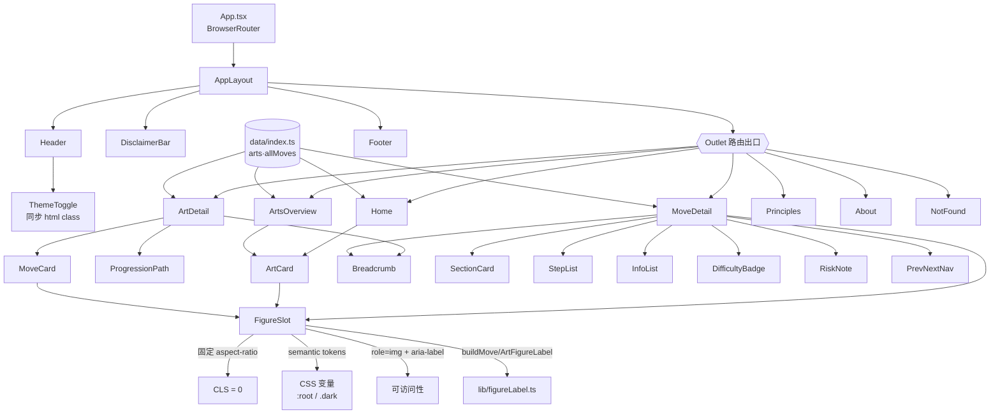
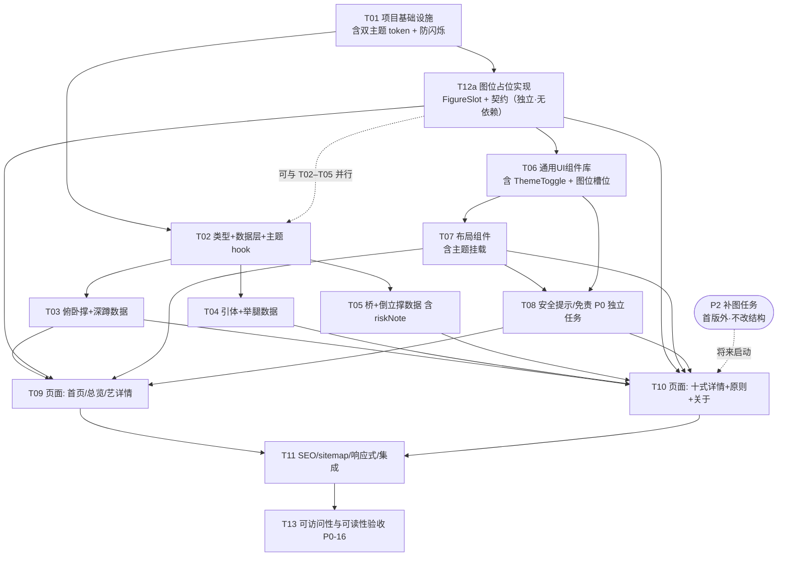

# 系统架构设计 + 任务分解 — 囚徒健身 · 六艺十式动作指导站

> 版本：**v1.4**（增量修订，同步 PRD v2.0）
> 作者：架构师 高见远
> 上游输入：`docs/PRD.md`（**v2.0**）、`docs/DYNAMIC-PLAN-DESIGN.md`（训练计划引擎设计）
> 技术前提（已锁定，不再论证）：Vite + React 18 + TypeScript + Tailwind CSS，纯静态 SPA，托管 Cloudflare Pages
> 状态：已实现

---

## v1.4 变更记录（v2.0 落地：规则引擎 + 进度系统 + 视觉层重构）

PRD v2.0 把「训练打卡」与「自动生成训练计划」从 P2 提进本期，架构层相应地新增两层模块。
**核心约束：引擎与 UI 严格分层**，因为引擎必须能在 Node 里跑单测，而 UI 必须能在契约冻结后独立改动。

### 新增目录与依赖方向

```
UI 层       src/pages/**  src/components/**（含 plan/ 子目录）
                │  ── 只消费 DailyPlan / SkillSnapshot 契约，不含规则逻辑
应用层      src/hooks/useTrainingState.ts        localStorage 读写 + actions
            src/hooks/TrainingProvider.tsx       全站共享单一状态实例（Context）
                │
规则引擎层  src/lib/plan/**（纯函数 · 无副作用 · 无 UI 依赖 · 不取系统时间）
            snapshot → gate → priority → select → budget → explain
            progression（晋级判定）· storage（持久化 schema + 迁移）
                │
配置层      src/lib/plan/config.ts                全部权重 / 阈值 / 矩阵 / 时间档预算
类型层      src/types/plan.ts                     领域契约（与 src/types/index.ts 平级）
数据层      src/data/arts/*.ts（现有 60 式，只读）
```

**依赖方向单向**：UI → hooks → engine → config/data。
引擎**绝不** `import React`、**绝不**读 `localStorage`、**绝不**取当前时间（时间由调用方传入参数）——
这是它能在 Vitest 里以纯 Node 环境运行的前提。

### 关键设计决定（三条，皆有测试固定）

1. **不新建内容表**：`TrainingSkill.volumeTier` 指向的「训练量阶梯」由 `Move.trainingGoal` 的三档
   （初级 / 中级 / 高级）**派生**；进阶条件清单由 `progressionStandard` 按逗号拆分得到。
   因此 60 式数据文件**一字未改**。
2. **难度与训练量分离**：`currentStep`（1–10，动作难度）与 `volumeTier`（0–2，同一式内的量）
   是两个独立维度；前者**只由用户点击推进**，后者由连续达标自动提升（仍需用户确认）。
3. **唯一生成入口**：首次生成、排除某艺、换方案、加减量、改时间，全部走
   `generateDailyPlan(state, options, revision)`，差异收敛到 `options`；无 `Math.random`，
   同输入必得同输出（回归测试用 `JSON.stringify` 做全等断言）。

### 新增持久化键

```
localStorage['cc.training.v1'] = {
  version, profile,                                   // 档案 + 首次使用引导答案
  skills: Record<ArtSlug, TrainingSkill>,             // 六艺进度 / 历史 / 训练量档
  sessions: WorkoutSession[],                         // 训练会话（最新在前，上限 200）
  todayPlan: DailyPlan | null                         // 今日计划缓存（跨刷新保留）
}
```

**单键存储**的理由：一次 `setItem` 原子落盘，避免多 key 写入中途失败导致状态互相矛盾。
`migrate()` 对缺字段一律补默认值，保证「旧数据 + 新版本代码」也能跑，而不是整份丢弃让用户白练。

### 新增 devDependency

`vitest`（**仅开发期**，不进入生产产物）。打包体积零增长，运行时依赖仍为
react / react-dom / react-router-dom / lucide-react 四项。

### 测试

- `src/lib/plan/plan.test.ts`：40 项，夹具即 `docs/DYNAMIC-PLAN-DESIGN.md` §10 的模拟数据，
  断言文档里每一个手算数字；
- `src/lib/designTokens.test.ts`：设计系统守卫 —— 扫描 Tailwind 透明度修饰符是否在刻度内
  （`bg-art-x/8` 这类值 Tailwind 不报错也不生成，会导致背景静默消失），
  并断言六艺色相在浅 / 深两套主题下的类名完整。

---

## v1.3 变更记录（架构层同步 · 图形渲染方案整体停用，改为「图位占位」）

**用户原话（本次变更的唯一依据）**：

> 「算了你这个图太他妈丑了，先把放图片的地方空着，别管图片了，其他的先做完」

**变更原因**：用户看过 **3 式姿态样板**（v1.2 的 `docs/pose-preview.html`，由 T12a 产出）后，**否定了这套矢量示意图的图形语言**。既然用户明确要求「先把放图片的地方空着、别的先做完」，架构层据此**全面停止图形渲染投入**。

**变更定性（关键，务必理解）**：**这不是「再换一种画法」，是「不再画」。**

- **姿态渲染路径整体从应用路径移除**：`PoseFigure` / `PoseStrip` / `src/data/poses/*` / dev 预览页 / `scripts/gen-pose-preview.mjs` / `scripts/pose-preview.entry.tsx` / `docs/pose-preview.html` 全部**移出应用**。这些产出**已实现但对当前交付无用**，登记为「**已实现、已停用并删除**」，并说明删除原因。
- **新增图位占位（Figure Slot）**：页面上**留出正确尺寸的空位**，布局与信息架构不变。图位是**空容器**，**不画任何人形、不画任何图形**，只做「极简、克制」的占位。
- **图位方案由用户拍板**：**不再讨论第 3 种图形方案**（不再有人工 SVG、也不再有 AI 位图）。将来如需图形，走「补图」路径（§5.5），届时**只加图片文件 + 极少量接线，不改页面结构**。

**架构层同步范围**：

| # | 变更点 | 涉及章节 |
|---|---|---|
| 1 | **图形渲染路径整体移除**：`PoseFigure.tsx`、`PoseStrip.tsx`、`src/data/poses/`（含 `types.ts` 与 6 个数据文件）、`src/dev/PosePreview.tsx` 及 `App.tsx` 中的 dev 路由、`docs/pose-preview.html`、`scripts/gen-pose-preview.mjs`、`scripts/pose-preview.entry.tsx`，以及 `src/data/index.ts` 的 `allPoses`/`getPose`/`getPoseByMove`/`getArtCoverPose` | §0、§1.2、§1.3、§2、§3.4、§3.5、§5 |
| 2 | **姿态数据模型「已评估、未采纳」**：原 §3.4 的姿态类型、坐标系统、自检方案等**压缩为一个小节保留**（**不整章删除**——这是有价值的评估结论），标注「**已评估、未采纳（图形语言未被用户接受），暂停备查**」 | §3.4 |
| 3 | **新增 `FigureSlot.tsx` 图位组件**（契约见 §5.4、§3.6）：`role="img"` + `aria-label`、固定 `aspect-ratio`（CLS=0）、极简占位、**零硬编码色值** | §1.3、§2.6、§3.6、§5.4、§9.7 |
| 4 | **`Art.coverPose` 直接移除**：v1.2 为姿态方案新增的封面对段（存 `moveSlug`）**不再需要**——图位由艺自身信息渲染即可。影响面 3 处：`src/types/index.ts`、`src/data/artsMeta.ts`、未来 `ArtCard.tsx` | §3.1、§2.4 |
| 5 | **§5 整章重写**：由「矢量示意图规格」→「**图位占位规范**」：各场景比例（六艺封面 3:4 / 十式主图 3:2 / 列表缩略 1:1）、**详情页恢复单一图位**（取消三帧分解）、将来补图的文件名约定与替换路径（§5.5/§5.6） | §5 |
| 6 | **任务列表更新**：**取消 T12b/T12c/T12d**（不再制作 57 式姿态数据）；**T12a 改写**为「图位占位实现」（`FigureSlot` + 各场景接入），且与内容数据**解耦、无依赖**；**新增「补图任务」为 P2 待办**（不在首版范围）；复核 T06/T07/T09/T10 对图位的依赖；复核依赖图与关键路径；重新报告文件数 / 任务数 | §7、附录依赖图 |
| 7 | **连带更新**：设计输入回顾、关键取舍、设计难点（「姿态数据的准确性与可校验性」→「**图位预留与将来无痛替换**」）、文案规范（图位 `aria-label`）、可访问性（`role="img"` + `aria-label`）、待明确事项（新增「图片来源待定」） | §0、§1.1、§1.2、§9.5、§9.7、§10 |
| 8 | **移除 `ImageFrame.tsx`（team-lead 拍板）**：首版零位图、无人调用，属死代码；将来 Hero/OG 真需位图时再补 | §2.6、§5.7 |
| 9 | **新增 `src/lib/figureLabel.ts`（team-lead 拍板）**：图位 `label` 由两条纯函数 `buildMoveFigureLabel`/`buildArtFigureLabel` 统一生成（§5.4.5），避免多处手拼风格不一 | §2.3、§5.4.5 | 
| 10 | **`FIGURE_SLOT_DEFAULT_NOTE` 归位 `FigureSlot.tsx` 内**（保 T12a 零依赖）；**§5.5 补图路径标注为「唯一真源」**并禁止页面硬编码路径；**详情页单一图位确认**；`label` 工具归属 **T02** | §3.6、§5.4、§5.5、§7 |

**v1.3 补充说明（team-lead 拍板）**：`ImageFrame` 砍掉、`figureLabel.ts` 新增后，**文件总数仍为 56**（v1.2 的 64 − 10 删 + 2 增）；`FIGURE_SLOT_DEFAULT_NOTE` 定义在 `FigureSlot.tsx` 内；**`§5.5` 的文件名规则是补图路径的唯一真源**（禁止第二套命名、禁止页面硬编码路径）。

**不变项（本次未改动，务必遵守）**：

- **60 式的数据结构与 13 个内容字段**（`description`/`steps`/`keyPoints`/`commonMistakes`/`progressionStandard`/`regression`/`trainingGoal`/`muscles`/`riskNote`/`english`）—— **内容层已通过独立 QA 双轮验证，本次不动**；
- 路由表与 `public/_redirects` SPA 回退方案（§4）；
- 「`prevStep`/`nextStep` 由聚合层按下标派生」的设计（§3.2）；
- 7 个页面的信息架构（§4.1）；
- 双主题机制（`darkMode:'class'` + CSS 变量）与可访问性量化指标（§9.3、§9.7）；
- **依赖极简原则**：**不引入** `sharp` / 任何图像处理库 / 任何图表库 / 任何新依赖（§8）。图位为**纯 CSS/DOM**，零新增依赖。

---

## v1.2 变更记录（架构层同步 · 图片方案整体替换）

**变更原因**：用户反馈「**这些图片我不需要写实的真人，重点是保证动作指导的准确性，可以用简约的示意图也行**」。已实测 AI 写实图出现**动作错误**（单腿深蹲第 10 式被画成第 8 式的下沉深度），**准确性不可控、不可校验**，与「动作指导」目标直接冲突。PRD 升级至 v1.2，图片方案由「AI 生成位图」**整体替换**为「**数据驱动的简约矢量示意图**」。

**核心决策一句话**：示意图**不是装饰，是动作指导的组成部分**；其正确性由**可复核的姿态数据**（关节角度 + 关键点坐标）保证，而非 AI 的观感。

**架构层同步范围**：

| # | 变更点 | 涉及章节 |
|---|---|---|
| 1 | **图片方案整体作废**：删除 AI 位图（66 张）全套规格与 prompt；`public/images/` 目录废弃（含已生成 4 张 PNG，须清理避免进入构建产物） | §0、§1.2、§2、§8 |
| 2 | **新增姿态数据模型**：每式 3 帧（起始/中段/终点）。**最终决定：以「归一化关键点坐标」为渲染真源，「关节角度」为派生/校验层**（§3.4.1）；独立数据集 `src/data/poses/*.ts` | §3.4、§5 |
| 3 | **新增渲染组件**：`PoseFigure.tsx`（单帧 SVG 渲染，`<line>` 粗细分级 + `currentColor` 主题自适应）、`PoseStrip.tsx`（三帧并排排版） | §2.6、§3.5、§5.5 |
| 4 | **`ImageFrame` 去留结论**：**降级保留**为「受限的静态资源容器」，不再承载动作图；姿态示意图一律走 `PoseFigure`（见 §5.5） | §2.6、§5.5 |
| 5 | **`Move` 类型契约不动**：姿态数据独立成集，按 `moveSlug` 索引；`Move` 契约（T02 已实现）**零改动**，把返工降到最低 | §3.4、§3.5 |
| 6 | **任务列表更新**：**T12 整体重写**为「实现姿态渲染器 + 编写 60 式姿态数据」，并拆为 **T12a–T12d** 可并行子任务；文件数与任务数重新统计 | §7、附录依赖图 |
| 7 | **连带更新**：设计输入回顾、关键取舍、设计难点（「66 张图分批」→「姿态数据的准确性与可校验性」）、文案规范（示意图 `alt`/图注）、可访问性（示意图 ARIA） | §0、§1.1、§1.2、§9.5、§9.7 |

**不变项（本次未改动，务必遵守）**：

- 60 式数据结构语义与 13 字段内容字段（`description`/`steps`/`keyPoints`/`commonMistakes`/`progressionStandard`/`regression`/`trainingGoal`/`muscles`/`riskNote`/`english`）—— 语义与字段名**均不变**；
- 路由表与 `public/_redirects` SPA 回退方案（§4）；
- 「`prevStep`/`nextStep` 由聚合层按下标派生」的设计（§3.2）；
- 7 个页面的信息架构（§4.1）；
- 双主题机制（`darkMode:'class'` + CSS 变量）与可访问性量化指标（§9.3、§9.7）；
- **依赖极简原则**：**不引入** `sharp` / 任何图像处理库 / 任何图表库 / 任何 SVG 绘制库；示意图**纯手写 SVG**（§8）。

---

## v1.1 变更记录（架构层同步）

**变更原因**：用户反馈「UI 不要一定追求硬核暗黑，重点是要在手机上也看得清楚」。PRD 升级至 v1.1，视觉方向由「硬核暗黑」改为「**移动端可读性优先 / 默认浅色主题**」。

**架构层同步范围**：

| # | 变更点 | 涉及章节 |
|---|---|---|
| 1 | **设计 token 重写**：`tailwind.config.ts` 主 token 改为浅色默认；新增 `darkMode: 'class'` 与 `:root`/`.dark` 双主题 CSS 变量；**首版即可手动切换主题（localStorage 记忆）**，含首屏防闪烁 | §0、§1.1、§1.2、§2、§9.3 |
| 2 | **图片风格锚点重写**：作废 `dark industrial gym` / `deep shadows` / `film grain` 等旧风格词，改为「中性浅色背景 + 高对比动作主体」 | §0、§5.2、§5.4 |
| 3 | **`ImageFrame` 占位兜底改浅色主题**：占位块由暗底 + 网格纹理改为浅底 + 细描边 | §5.6 |
| 4 | **新增「可访问性与可读性」实施约束（跨文件必守）**：字号 / 行高 / 行宽 / 触控目标 / 对比度 / 键盘可达 / 语义化与 ARIA / `prefers-reduced-motion` / 禁止用颜色单独承载信息 | §9.7 |
| 5 | **任务列表更新**：T01 补主题配置与防闪烁、T02 补 `useTheme`、T06 补 `ThemeToggle`、T07 补主题挂载、**新增 T13 可访问性验收（P0-16）** | §7、附录依赖图 |
| 6 | **连带更新**：术语与设计输入回顾、关键取舍表、文案规范（`alt` 约定） | §0、§1.1、§9.5 |

**不变项（本次未改动）**：60 式数据结构与类型契约（`Move` 13 字段 + `riskNote` + `english`）、路由表、`public/_redirects` 方案、「prev/next 由聚合层派生」的设计、7 个页面的信息架构。

---

## 0. 设计输入回顾与关键术语

| 术语 | 含义 | 数量 |
|---|---|---|
| **六艺（Art）** | 六门基础动作门类 | 6 |
| **十式（Move）** | 每艺下 10 个递进难度动作 | 60 |
| **slug** | 英文路由标识 | — |
| **图位（Figure Slot）** | 页面中为「将来的动作图」**预留的空占位容器**；固定宽高比、`role="img"` + `aria-label`，**当前不渲染任何图形** | 每式 1 个 + 每艺 1 个 + 列表缩略若干 |

- 六艺固定原书顺序：**俯卧撑 → 深蹲 → 引体向上 → 举腿 → 桥 → 倒立撑**
- 每式详情页承载 **13 个结构化字段（PRD 第 4 章）+ `riskNote` + `english` 预留 = 15 字段模型**
- **图片方案沿革（务请知悉，避免走回头路）**：
  - v1.1：AI 生成**写实位图**（66 张）—— 用户否决（动作准确性不可控）；
  - v1.2：**数据驱动矢量示意图**（`PoseFigure` 手写 SVG）—— 用户看过样板后**否决图形语言**；
  - **v1.3（现行）：不再画图，改为「图位占位（Figure Slot）」**——页面留出**正确尺寸的空位**，布局与信息架构不变；将来补入真实图片时**不需改代码**。**图位方案由用户拍板，不再讨论第 3 种图形方案。**
- **视觉方向（v1.1 保留）**：**移动端可读性优先，默认浅色主题**；「硬核」气质由**排版层级**（粗体大标题 / 有序编号 / 等宽数字）与**克制的图位**传达，**不**靠暗底低对比、**也不**靠图形堆砌（详见 §9.3）
- **主题（v1.1 保留）**：浅色为默认值，深色为可选手动切换（首版即支持，`localStorage` 记忆）；「跟随系统偏好」留 P1（§9.3）

---

## 1. 实现方案与框架选型

### 1.1 关键取舍

| 项 | 选择 | 理由（一句话） |
|---|---|---|
| 构建工具 | **Vite 5** | 冷启动与 HMR 极快，纯静态产物直接 `dist/` 直传 Pages |
| UI 框架 | **React 18 + TypeScript** | 既定前提，类型安全支撑 60 条结构化数据渲染 |
| 渲染模式 | **纯客户端 SPA（CSR）** | 内容是静态数据文件，无后端/SSR 需求；**不选 Next.js** —— 引入 SSR/Node 运行时与 Cloudflare 适配成本，对纯内容站是过度设计 |
| 路由 | **react-router-dom v6（BrowserRouter + `_redirects`）** | 语义化 URL 有利于 SEO 与分享；刷新 404 由 `_redirects` 回退解决（见 §4） |
| 样式 | **Tailwind CSS 3 + CSS 变量双主题** | 浅色默认 / 深色可切换需精确控制 token，手写原子类比 MUI 更可控、零运行时、体积小；`darkMode: 'class'` 支撑主题切换 |
| 图标 | **lucide-react** | tree-shakable 轻量图标，风格克制，契合「靠排版传达硬核」的气质 |
| 数据承载 | **TS 模块（非 JSON fetch）** | 编译期类型校验 + tree-shaking，无需运行时加载/解析 JSON |
| **动作图（v1.3）** | **图位占位（`FigureSlot`）+ 将来补图** | 首版**不画任何图形**（用户已否决 AI 位图与矢量示意图两种方案）；改为在正确位置留出**固定宽高比的空占位**，`role="img"` + `aria-label` 保证读屏可用、`aspect-ratio` 保证 CLS=0；**零新增依赖**（纯 CSS/DOM） |
| 状态管理 | **无（仅 React 内置 + localStorage）** | 首版无跨页共享状态；两处持久态：①「免责提示条已关闭」②**主题偏好（light/dark）**。主题切换**手写**实现（§9.3），**不引入 `next-themes` 等依赖** |

### 1.2 核心设计难点

1. **60 条数据的可维护性与类型安全**：按「艺」拆 6 个文件 + 统一 interface + 聚合索引，避免单文件 3000+ 行。
2. **进阶链路（上一式/下一式）的零手工维护**：由聚合层用数组下标**派生生成** `prevStep/nextStep`，边界自动为 `null`，杜绝人工编号错漏（对应 P0-6）。
3. **SPA 刷新 404**：Cloudflare Pages 需 `public/_redirects` 兜底（见 §4.3）。
4. **图位预留与将来无痛替换（v1.3 重写，替代 v1.2 的「姿态数据的准确性与可校验性」）**：首版**不产出任何图形**，但页面**已经按最终版式留出图片位置**。难点在于「**当前空着、将来补图不改结构**」：① 图位用**固定 `aspect-ratio`** 渲染空占位，保证**有无图片时布局高度完全一致（CLS = 0）**；② 图片的宽高比、文件名规则、挂载点**在首版就约定好**（§5.5），补图时只需放入图片文件 + 在页面层渲染 ``，**不动 JSX 结构、不动数据契约**；③ 全站**零新增依赖**（不引入任何图像处理/图表/SVG 库），图位为**纯 CSS/DOM 占位**（§5.4）。
5. **可读性一致的浅色默认 + 可切换主题**：所有颜色收敛进 Tailwind `theme.extend.colors` + CSS 变量（`:root` 浅色 / `.dark` 深色），页面只引用语义 token；`darkMode: 'class'` + `<html>` 挂 class + 内联 script 防首屏闪烁，保证「手机看清」为第一优先级（对应 P0-12 / P0-16）。**图位同样只引用语义 token（`bg-surface-2` / `border-border` / `text-muted`），禁止硬编码色值**（对应 P0-17，见 §5.4）。

### 1.3 架构分层

```
┌──────────────────────────────────────────────────────────┐
│  Pages 层（7 页面，路由驱动）                              │
│  Home / ArtsOverview / ArtDetail / MoveDetail             │
│  / Principles / About / NotFound                          │
├──────────────────────────────────────────────────────────┤
│  Components 层                                            │
│  layout/(Header·Footer·DisclaimerBar)                     │
│  ui/(ArtCard·MoveCard·FigureSlot·...)                      │
├──────────────────────────────────────────────────────────┤
│  Data 层（纯数据 + 派生索引，无副作用）                     │
│  data/arts/*.ts (6)  → 内容字段                            │
│  data/index.ts (聚合 + prev/next 派生)                     │
│  data/artsMeta.ts (艺元数据)  ·  types/index.ts (类型契约)  │
├──────────────────────────────────────────────────────────┤
│  静态资源层  public/（图标 favicon.svg + _redirects + robots）│
│  ⚠ v1.3：无 public/images/（首版不放图片；补图阶段再建，§5.5）│
└──────────────────────────────────────────────────────────┘
   单向依赖：Pages → Components → Data → Types
   图位数据流：页面取艺/式信息 → 拼 label → FigureSlot 渲染空占位
   ⚠ v1.3：姿态数据流（data/poses/* → PoseFigure → 页面）已整体移除
```

---

## 2. 目录与文件清单

> 全部为**新建**。相对工作目录 `D:/code/WorkBoddy/囚徒健身`。
> **v1.3 变更**：移除 v1.2 的 `src/data/poses/`（7 个文件）与 `PoseFigure`/`PoseStrip`（2 个文件）；新增 `FigureSlot.tsx`（1 个文件）；移除 `scripts/gen-pose-preview.mjs` 与 `scripts/pose-preview.entry.tsx`（2 个），`scripts/` 仅保留 `gen-sitemap.mjs`。
> 数据层决策：**内容按艺拆 6 个文件**——`src/data/arts/*.ts`（每文件 10 条 `Move` + 艺元数据所需字段）；`src/data/index.ts` 统一装配、**派生** `prevStep/nextStep`。理由：① 单文件可控；② 内容可 3 人并行（各每 2 艺一人）；③ 未来增删艺不影响其他文件。**v1.3：姿态数据集整体删除，`Move` 契约与内容字段零改动。**

### 2.1 根配置（11 个文件）

| # | 相对路径 | 说明 |
|---|---|---|
| 1 | `package.json` | 依赖与脚本（dev/build/preview） |
| 2 | `vite.config.ts` | Vite + React 插件 + `@` 别名 |
| 3 | `tsconfig.json` | TS 主配置 + paths 别名 |
| 4 | `tsconfig.node.json` | Node 侧（vite.config）TS 配置 |
| 5 | `tailwind.config.ts` | 设计 token（配色/字体/断点/行宽）+ `darkMode: 'class'` |
| 6 | `postcss.config.js` | Tailwind + autoprefixer |
| 7 | `index.html` | HTML 模板（`lang`/title/description/favicon/OG）+ **主题初始化内联脚本（防首屏闪烁）** |
| 8 | `.gitignore` | 忽略 node_modules/dist |
| 9 | `public/_redirects` | **Cloudflare Pages SPA 回退（关键）** |
| 10 | `public/favicon.svg` | 站点图标（单色，浅 / 深主题均适配） |
| 11 | `public/robots.txt` | 爬虫规则 + sitemap 指向 |

### 2.2 入口与路由（4 个文件）

| # | 相对路径 | 说明 |
|---|---|---|
| 12 | `src/main.tsx` | React 挂载入口 |
| 13 | `src/App.tsx` | 路由表装配 + 全局 Layout |
| 14 | `src/index.css` | Tailwind 指令 + `:root`/`.dark` 双主题 CSS 变量 + 全局基础样式 + `focus-visible` 焦点环 + `prefers-reduced-motion` |
| 15 | `src/vite-env.d.ts` | Vite 类型声明 |

### 2.3 类型与工具（7 个文件）

| # | 相对路径 | 说明 |
|---|---|---|
| 16 | `src/types/index.ts` | `Art` / `Move` / `MoveDifficulty` / `ArtSlug` 等（**v1.3：`Art` 无 `coverPose`**） |
| 17 | `src/lib/slug.ts` | slug 生成/解析（`moveSlug`、`artSlug`） |
| 18 | `src/lib/constants.ts` | 六艺顺序、难度档位映射、文案常量、**难度等级 → token 映射** |
| 19 | `src/hooks/useLocalStorage.ts` | 持久化 hook（免责条记忆；主题偏好复用同一模式） |
| 20 | `src/hooks/useTheme.ts` | **主题 hook（v1.1 新增）**：读写 `light`/`dark`、同步 `<html>` class、`localStorage` 记忆 |
| 21 | `src/lib/seo.ts` | `useDocumentMeta(title, desc)` 每页 title/description |
| 22 | `src/lib/figureLabel.ts` | **图位 label 生成（v1.3 新增）**：`buildMoveFigureLabel()` / `buildArtFigureLabel()` 两条纯函数（§5.4.5）；供 ArtCard / MoveCard / MoveDetail 拼 `FigureSlot` 的 `label` |

### 2.4 数据层（8 个文件）

> **v1.3：`src/data/poses/` 目录（含 `types.ts` + 6 个姿态数据文件）整体删除。**

| # | 相对路径 | 说明 |
|---|---|---|
| 23 | `src/data/arts/pushups.ts` | 俯卧撑 1–10 式 |
| 24 | `src/data/arts/squats.ts` | 深蹲 1–10 式 |
| 25 | `src/data/arts/pullups.ts` | 引体向上 1–10 式 |
| 26 | `src/data/arts/legRaises.ts` | 举腿 1–10 式 |
| 27 | `src/data/arts/bridges.ts` | 桥 1–10 式 |
| 28 | `src/data/arts/handstandPushups.ts` | 倒立撑 1–10 式 |
| 29 | `src/data/index.ts` | 聚合 + 派生索引（`getArt`/`getMove`/`getMovesByArt`/`getAdjacentArts`；**v1.3：删除 `allPoses`/`getPose`/`getPoseByMove`/`getArtCoverPose`**，见 §3.2） |
| 30 | `src/data/artsMeta.ts` | 六艺展示元数据（顺序、定位语、肌群）；**v1.3：删除 v1.2 的 `coverPose` 字段**（§3.1） |

### 2.5 布局组件（4 个文件）

| # | 相对路径 | 说明 |
|---|---|---|
| 31 | `src/components/layout/AppLayout.tsx` | 顶栏 + 主区 + 页脚 + 首访提示条容器 |
| 32 | `src/components/layout/Header.tsx` | 导航（含移动端汉堡菜单 + **主题切换入口 ThemeToggle**） |
| 33 | `src/components/layout/Footer.tsx` | 来源标注 + 免责声明 + 版权（常驻） |
| 34 | `src/components/layout/DisclaimerBar.tsx` | 顶部首访安全提示条（可关闭 + localStorage） |

### 2.6 UI 组件（14 个文件）

| # | 相对路径 | 说明 |
|---|---|---|
| 35 | `src/components/ui/FigureSlot.tsx` | **图位占位组件（v1.3 新增 · 核心）**：输入 `ratio`/`label`/`badge?`/`note?` → 输出**固定宽高比的空占位**（`role="img"` + `aria-label`），**不画任何图形**；零硬编码色值（详见 §5.4、§3.6） |
| 36 | `src/components/ui/DifficultyBadge.tsx` | 难度等级徽章（等级色 + **文字标签**，色非唯一手段） |
| 37 | `src/components/ui/StepList.tsx` | 分解步骤有序列表（编号） |
| 38 | `src/components/ui/InfoList.tsx` | 要领 / 错误通用列表（success/danger 变体，**带文字标签**） |
| 39 | `src/components/ui/SectionCard.tsx` | 「标签 + 内容」分块卡片容器 |
| 40 | `src/components/ui/ArtCard.tsx` | 六艺卡片（**封面位 = `FigureSlot`（ratio 3/4）** + 艺名 + 定位语） |
| 41 | `src/components/ui/MoveCard.tsx` | 招式卡片（**缩略位 = `FigureSlot`（ratio 1/1）** + 序号 + 中英文名 + 难度） |
| 42 | `src/components/ui/ProgressionPath.tsx` | 十式进阶路径阶梯条 |
| 43 | `src/components/ui/PrevNextNav.tsx` | 上一式/下一式导航（null 边界处理） |
| 44 | `src/components/ui/Breadcrumb.tsx` | 面包屑（首页 / 六艺 / 艺 / 式） |
| 45 | `src/components/ui/RiskNote.tsx` | 高风险动作额外风险提示块 |
| 46 | `src/components/ui/SafetyNotice.tsx` | 通用安全提示块（可跳转训练原则） |
| 47 | `src/components/ui/Button.tsx` | 统一按钮/链接样式（含 `focus-visible` 焦点环） |
| 48 | `src/components/ui/ThemeToggle.tsx` | **主题切换按钮（v1.1 新增）**：浅/深切换，同步 `<html>` class，含 `aria-label` |

> **v1.3 移除**：`PoseFigure.tsx`、`PoseStrip.tsx`（原 v1.2 的 #41、#42）**已实现，现删除**；`ImageFrame.tsx`（v1.2 曾计划保留）**从未实现，现从计划移除**（team-lead 拍板）。三者均从应用路径消失（§5.7）。

### 2.7 页面（7 个文件）

| # | 相对路径 | 说明 |
|---|---|---|
| 49 | `src/pages/Home.tsx` | 首页 |
| 50 | `src/pages/ArtsOverview.tsx` | 六艺总览 |
| 51 | `src/pages/ArtDetail.tsx` | 六艺详情 |
| 52 | `src/pages/MoveDetail.tsx` | 十式详情（核心页，**顶部单一图位 `FigureSlot`（ratio 3/2）**） |
| 53 | `src/pages/Principles.tsx` | 训练原则 |
| 54 | `src/pages/About.tsx` | 关于 / 免责声明 |
| 55 | `src/pages/NotFound.tsx` | 404 |

### 2.8 构建产物辅助脚本（1 个文件）

| # | 相对路径 | 说明 |
|---|---|---|
| 56 | `scripts/gen-sitemap.mjs` | 构建后生成 `dist/sitemap.xml`（P0-15） |

> **v1.3 移除脚本**：`scripts/gen-pose-preview.mjs`、`scripts/pose-preview.entry.tsx`（配合 `docs/pose-preview.html` 的姿态预览产物）已随图形方案一并删除（§5.7）。

**合计：56 个文件**（较 v1.2 的 64 个**净减 8 个**：删除 `poses/types.ts` + 6 个姿态数据集 + `PoseFigure.tsx` + `PoseStrip.tsx` + `ImageFrame.tsx` 共 **10 个**，新增 `FigureSlot.tsx` + `lib/figureLabel.ts` 共 **2 个**）。**首版不含任何图片资源**（`public/images/` 目前不存在；补图阶段再建，见 §5.5）。

> **可选 dev-only（不在上式计数内）**：**v1.3 已无任何 dev 预览页**（`src/dev/PosePreview.tsx` 随方案删除，`App.tsx` 的 dev 路由一并移除）。

---

## 3. 数据结构与接口定义

### 3.1 类型契约（`src/types/index.ts`）

```ts
/** 六艺 slug 字面量联合 —— 全站路由与数据的唯一真源 */
export type ArtSlug =
  | 'pushups'
  | 'squats'
  | 'pullups'
  | 'leg-raises'
  | 'bridges'
  | 'handstand-pushups';

/** 难度等级枚举（对应 PRD：序号 1-2/3-4/5-6/7-8/9-10） */
export type MoveDifficulty = '入门' | '初级' | '中级' | '进阶' | '高阶';

/** 动作所在艺的精简引用（用于 Move 内部，避免循环依赖） */
export interface ArtRef {
  slug: ArtSlug;
  nameZh: string;
  nameEn: string;
}

/** 上一式 / 下一式的精简引用，由聚合层派生 */
export interface StepRef {
  stepNo: number;
  nameZh: string;
  href: string; // 形如 /arts/pushups/2
}

/** 单式（Move）完整模型：PRD 第 4 章 13 字段 + riskNote + english(预留) */
export interface Move {
  /** 派生：所属艺引用（写入数据文件时给出，聚合层据此补齐） */
  artRef: ArtRef;

  /** 序号 1–10 */
  stepNo: number;

  /** 中文名，如「标准俯卧撑」 */
  nameZh: string;

  /** 英文名，如「Full Push-ups」（检索 + 图片 prompt 用） */
  nameEn: string;

  /** 首版 UI 纯中文，此字段为将来双语预留；等于 nameEn */
  english?: string;

  /** 难度等级 */
  difficulty: MoveDifficulty;

  /** 动作描述：一段话说明这是什么动作、练什么 */
  description: string;

  /** 分解步骤：有序列表，4–7 步 */
  steps: string[];

  /** 要领要点：3–5 条 */
  keyPoints: string[];

  /** 常见错误：3–5 条，含「错误表现 —— 纠正」 */
  commonMistakes: string[];

  /** 进阶标准：达到什么程度算过关 */
  progressionStandard: string;

  /** 降阶方案：太难时的退阶（指向上一式或替代） */
  regression: string;

  /** 训练目标：组数×次数 / 时长 */
  trainingGoal: string;

  /** 主要发力肌群 */
  muscles: string[];

  /** 高风险动作额外提示；仅高风险式（倒立撑全系、桥全系、单臂类）填写 */
  riskNote?: string;

  /** 派生字段：上一式，第一式为 null（由聚合层生成，写入时留空） */
  prevStep?: StepRef | null;

  /** 派生字段：下一式，第十式为 null（由聚合层生成，写入时留空） */
  nextStep?: StepRef | null;
}

/** 艺（Art）展示元数据 */
export interface Art {
  slug: ArtSlug;
  order: number;          // 固定原书顺序 1–6
  nameZh: string;
  nameEn: string;
  /** 一句话定位（卡片用） */
  tagline: string;
  /** 页头介绍段落 */
  intro: string;
  /** 主要发力肌群（艺级概览） */
  muscles: string[];
  /** 该艺 10 式（顺序 = stepNo） */
  moves: Move[];
}

/** 派生后的完整动作视图（保证 prevStep/nextStep 非 undefined） */
export type ResolvedMove = Move & {
  prevStep: StepRef | null;
  nextStep: StepRef | null;
  slug: string; // 如 pushups-05
};
```

> **【v1.3 契约变更】删除 `Art.coverPose`。**
>
> - **背景**：`coverPose` 是 v1.2 为「矢量示意图」方案引入的字段（存封面所用姿态的 `moveSlug`，让 `getArtCoverPose()` 取 `PoseSet` 渲染封面）。
> - **结论**：**直接移除**。图位方案下，封面位由**艺自身信息**渲染——`FigureSlot` 只吃 `ratio`（六艺封面 = `3/4`）、`label`（由 `art.nameZh` + `tagline` 拼出）、可选 `badge`/`note`，**不需要任何 `moveSlug` 映射**。
> - **受影响文件（3 处）**：① `src/types/index.ts`（删除 `Art.coverPose` 及其注释）；② `src/data/artsMeta.ts`（删除 6 处 `coverPose: moveSlug(...)` 与相关注释、去掉对 `moveSlug` 的 import）；③ 未来 `src/components/ui/ArtCard.tsx`（**不消费** `coverPose`，改为直接取 `art` 渲染 `FigureSlot`）。
> - **`Move` 契约仍零改动**；`src/lib/slug.ts` 的 `moveSlug()` 仍保留（sitemap 用），仅封面不再依赖它。

### 3.2 聚合层接口（`src/data/index.ts`）

```ts
import type { Art, ArtSlug, Move, ResolvedMove } from '@/types';

/** 全部六艺（按 order 升序），聚合后 prevStep/nextStep 已补齐 */
export const arts: Art[];

/** 扁平化的 60 式（已 resolve），用于 sitemap / 检索 / 快速跳转 */
export const allMoves: ResolvedMove[];

/** 按 slug 取艺 */
export function getArt(slug: string): Art | undefined;

/** 按 artSlug + stepNo 取式 */
export function getMove(artSlug: string, stepNo: number): ResolvedMove | undefined;

/** 按 move slug（如 pushups-05）取式 */
export function getMoveBySlug(slug: string): ResolvedMove | undefined;

/** 取某艺的全部式 */
export function getMovesByArt(artSlug: ArtSlug): ResolvedMove[];

/** 取相邻艺（用于六艺详情页 上一艺/下一艺） */
export function getAdjacentArts(slug: ArtSlug): { prev?: Art; next?: Art };
```

> **派生逻辑**：`data/arts/*.ts` 里每条 `Move` **不写** `prevStep/nextStep`；`data/index.ts` 在装配时对每艺数组按下标生成 `StepRef` 并写出 `href = /arts/{artSlug}/{stepNo}`，边界置 `null`。这使 P0-6 的链路正确性由代码保证，人工无法出错。

### 3.3 真实示例数据：标准俯卧撑（俯卧撑第 5 式）

```ts
// src/data/arts/pushups.ts（节选）
import type { Move } from '@/types';

export const pushupMoves: Move[] = [
  // ... 1–4 式略 ...
  {
    artRef: { slug: 'pushups', nameZh: '俯卧撑', nameEn: 'Push-ups' },
    stepNo: 5,
    nameZh: '标准俯卧撑',
    nameEn: 'Full Push-ups',
    english: 'Full Push-ups',
    difficulty: '中级',
    description:
      '俯卧撑体系的基准动作，也是检验上肢推力水平的黄金标准。身体如平板般撑地，靠胸、肩、臂协同完成全程升降，是通往单臂俯卧撑的分水岭。',
    steps: [
      '俯身撑地，双手略宽于肩，掌心朝下、手指朝前',
      '双脚并拢或略分开，脚尖点地，身体从头到脚跟成一条直线',
      '收紧腹部与臀部，锁定身体，不塌腰不撅臀',
      '屈肘下沉，肘部与躯干约呈 45°，胸部缓缓降至接近地面',
      '在最低点稍作停顿，不触地',
      '发力推起，直至手臂完全伸直，为一次',
    ],
    keyPoints: [
      '全程核心与臀部收紧，身体始终成一条直线',
      '肘部贴近躯干约 45°，避免外翻过度压迫肩关节',
      '下沉 2 秒、推起 1 秒，离心阶段控制质量',
      '肩胛随动作自然收放，顶峰位略推离地面',
      '视线看向前方地面，保持颈椎中立不抬头',
    ],
    commonMistakes: [
      '塌腰或撅臀 —— 收紧核心与臀部，锁定直线',
      '头部前探或后仰 —— 保持颈椎中立，视线朝前下方',
      '肘部外展近 90° —— 收肘至约 45°，保护肩关节',
      '下沉不到位或幅度忽大忽小 —— 以胸部接近地面为统一标准',
      '靠惯性快速起落 —— 放慢离心，感受胸臂发力',
    ],
    progressionStandard: '2 组 × 20 次，全程动作标准、身体成直线、无借力与塌腰。', // 数值真源见 docs/content-reference.md 第 2 节
    regression: '若无法完成全程，退回第 4 式半俯卧撑，或抬高双手位置加大倾斜角度。',
    trainingGoal: '初级 1 组 × 5 次 → 中级 2 组 × 12 次 → 升阶 2 组 × 20 次', // 格式硬规定见 content-reference.md 第 3 节
    muscles: ['胸大肌', '三角肌前束', '肱三头肌', '前锯肌'],
    // riskNote: 标准俯卧撑非高风险，留空
    // prevStep / nextStep 由聚合层派生，此处不写
  },
  // ... 6–10 式略 ...
];
```

---

### 3.4 姿态数据模型（**已评估、未采纳** · v1.3 暂停备查）

> **状态：已评估、未采纳 —— 图形语言未被用户接受，暂停备查。**
>
> v1.2 曾设计一套「数据驱动矢量示意图」方案（`PoseFigure` 渲染「归一化关键点坐标 + 关节角度」）。用户看过 3 式样板（`docs/pose-preview.html`）后**否决了这套图形语言**，v1.3 据此改为**图位占位**（§5）。**本节不做删除**——它是一份有价值的评估结论，供**将来可能重启图形方案时**参考；但当前**不投入任何实现**。
>
> **当前处置**：`src/data/poses/`（7 文件）、`PoseFigure.tsx`、`PoseStrip.tsx`、`src/dev/PosePreview.tsx`、`docs/pose-preview.html`、`scripts/gen-pose-preview.mjs`、`scripts/pose-preview.entry.tsx` 全部**移出应用路径并删除**（§5.7）。

#### 3.4.A 评估结论要点（备忘）

| 维度 | 当时的结论（保留备查） |
|---|---|
| **数据真源选择** | 以「**归一化关键点坐标**」为主表达（每个关节在 `200×200` viewBox 中的 `{x,y}`），「**关节角度**」为**派生/校验层**（由坐标反算）。理由：坐标为渲染真源、天然可表达近/远肢遮挡、多视角即坐标差异、跨式比例一致；角度用于校验与标注。 |
| **坐标系统** | `POSE_VIEWBOX = {w:200,h:200}`，原点左上、+y 向下，留 10 单位安全边；`HEAD_R = 11`；人体比例常量 `HUMAN`（`neckToHip:52` / `neckToHead:14` / `shoulderToElbow:26` / `elbowToHand:24` / `hipToKnee:30` / `kneeToAnkle:30`）保证 60 式同一骨架尺度。 |
| **类型集合** | `Pt` / `ArmChain` / `LegChain` / `Skeleton` / `PoseProp(+Type)` / `PoseAnnotation` / `PoseView` / `PoseFrame(Label)` / `PoseSet`：每式一组 `PoseSet`（固定 3 帧 = 起始/中段/终点，同一视角），独立于 `Move` 存放、按 `moveSlug` 索引。 |
| **数据放置** | 独立数据集 `src/data/poses/{artSlug}.ts`（`Record<moveSlug, PoseSet>`），`Move` 契约零改动；聚合层用 `getPose(moveSlug)` 关联（**v1.3 已删除该接口**，§3.5）。 |
| **自检方案** | dev 预览页放大三帧 + 浅/深主题切换 + 逐帧目视核对清单（plank 共线、`squats-10` 终点 `hip.y>knee.y`、`pullups-05` 终点 `head.y≤bar.y` 等），把「准确性」工程化。 |
| **为何未采纳** | 用户认为该图形语言**观感不合格**；且首版交付目标为「其余功能先做完」，不值得继续打磨图形。**不再讨论第 3 种图形方案**（既不再手绘 SVG，也不回到 AI 位图）。 |

> **重启提示（若将来恢复图形）**：上述类型 / 坐标系统 / 校验清单均可复用；重启时须**重新评估观感与工作量，并由用户确认图形方向后再进入实现**。

---

### 3.5 聚合层接口变更说明（v1.3）

> **本节的 v1.1 接口清单即 §3.2，不重复列出。**
>
> **【v1.3 删除的姿态索引接口】**：v1.2 曾在此节增补 `allPoses` / `getPose(moveSlug)` / `getPoseByMove(artSlug, stepNo)` / `getArtCoverPose(artSlug)`，**现已全部删除**——它们只服务于已停用的姿态渲染方案（§3.4）。**图位不需要任何数据索引**：页面直接从 `Art` / `ResolvedMove` 取 `nameZh` / `description` 等字段拼 `FigureSlot` 的 `label` 即可。

---

### 3.6 图位组件契约（`src/components/ui/FigureSlot.tsx` · v1.3 新增）

```ts
/** 图位宽高比：六艺封面 3/4、十式主图 3/2、列表缩略 1/1 */
export type FigureRatio = '3/4' | '3/2' | '1/1';

export interface FigureSlotProps {
  /** 宽高比（决定固定高度，保证有无图片时布局一致） */
  ratio: FigureRatio;

  /** 无障碍标签：描述该式/该艺动作本身（如「标准俯卧撑：身体成直线，肘部约 45°，胸部下沉接近地面」），不是文件名 */
  label: string;

  /** 可选角标，如「第 5 式」 */
  badge?: string;

  /** 可选补充说明；默认文案常量「图片待补充」 */
  note?: string;

  className?: string;
}
```

> 详细视觉规范、主题适配、将来补图的替换路径见 **§5.4 / §5.5**。**组件为零依赖的纯 CSS/DOM 占位，不画任何图形。**

---

## 4. 路由设计

### 4.1 路由表

| 路径 | 页面组件 | 参数 | 说明 |
|---|---|---|---|
| `/` | `Home` | — | 首页：Hero + 六艺网格 + 如何开始 + 安全条 |
| `/arts` | `ArtsOverview` | — | 六艺总览：6 张艺卡片 + 推荐顺序 |
| `/arts/:artSlug` | `ArtDetail` | `artSlug` | 六艺详情：艺介绍 + 进阶路径 + 十式列表 |
| `/arts/:artSlug/:stepNo` | `MoveDetail` | `artSlug`, `stepNo`(1–10) | 十式详情（核心页，13 字段） |
| `/principles` | `Principles` | — | 训练原则 |
| `/about` | `About` | — | 关于 / 免责声明 |
| `*` | `NotFound` | — | 404 兜底 |

- 非法 `artSlug` 或 `stepNo`（非 1–10 / 越界）：`MoveDetail` / `ArtDetail` 内部 `getArt/getMove` 返回 `undefined` 时**渲染 NotFound 内容**（保持 HTTP 200 语义，SPA 内处理）。
- `artSlug` 取值：`pushups` / `squats` / `pullups` / `leg-raises` / `bridges` / `handstand-pushups`。

### 4.2 路由实现：BrowserRouter

**结论：使用 `BrowserRouter`（不用 HashRouter）。**

| 方案 | 优点 | 缺点 | 结论 |
|---|---|---|---|
| BrowserRouter + `_redirects` | URL 语义化（`/arts/pushups/5`）、利于 SEO 与分享、契合 P0-15 | 需服务端回退配置 | ✅ **采用** |
| HashRouter | 无需服务端配置 | URL 带 `#`、不利于 SEO 与分享、观感差 | ❌ 不采用 |

Cloudflare Pages 支持 `_redirects` 文件做 SPA 回退，成本极低，因此没有理由牺牲 URL 语义。

### 4.3 `public/_redirects` 文件内容（关键）

```
/*  /index.html  200
```

- 语义：所有未匹配静态文件的路径，**以状态码 200 返回 `index.html`**（而非 302 重定向），交由 React Router 在客户端解析。
- 该文件位于 `public/`，Vite 构建时原样拷贝到 `dist/` 根目录，Cloudflare Pages 自动读取生效。
- 注意：需放在 `public/`（不是项目根），否则不会进入 `dist/`。

### 4.4 移动式 slug（Move slug）生成规则

```ts
// src/lib/slug.ts
export const moveSlug = (artSlug: ArtSlug, stepNo: number): string =>
  `${artSlug}-${String(stepNo).padStart(2, '0')}`;
// pushups + 5     => 'pushups-05'
// leg-raises + 3  => 'leg-raises-03'
// handstand-pushups + 10 => 'handstand-pushups-10'
```

- Move slug 主要用于：图片文件名映射、sitemap、`getMoveBySlug` 检索键。
- **路由 URL 不使用 move slug**，而是用 `/arts/{artSlug}/{stepNo}`（更短、更直观、便于「上一式/下一式」数字运算）。两者通过 `artSlug + stepNo` 一一对应。

---

## 5. 图位占位规范（v1.3 重写 · 重点）

> 本节整体替换 v1.2 的「矢量示意图规格」章节。**首版不产出任何图片**：页面上为「将来的动作图」预留**固定尺寸的空位（图位，Figure Slot）**，布局与信息架构不变。**图位方案由用户拍板，不再讨论第 3 种图形方案。**

### 5.1 设计目标：空着，但「将来补图不改结构」

图位的唯一设计约束：**当前空着，将来补图时不改代码、不破版、不产生布局跳动（CLS）。**

| 目标 | 落地手段 |
|---|---|
| 版式最终态即当前态 | 图位用**固定 `aspect-ratio`** 撑出与最终图片**完全一致的高度**；有图 / 无图高度相同 → **CLS = 0** |
| 补图不改结构 | 文件名与挂载点**首版就约定**（§5.5）；补图时按约定放入图片、页面层给 ``，**JSX 结构不变** |
| 读屏可用 | 图位是 `role="img"` + `aria-label`（`label` 必须描述动作本身，**即使当前无图**，§9.7.4） |
| 观感克制 | 极简占位（`bg-surface-2` + `border-border` + 单色小图标 + 角标 + 说明），**不画人形 / 不画图形**；颜色只走语义 token，浅 / 深主题自适应 |
| 零新增依赖 | 纯 CSS/DOM（Tailwind + 一个 lucide 图标），**不引入**任何图像处理 / 图表 / SVG 库 |

### 5.2 各场景图位比例

| 场景 | 组件位置 | `ratio` | 说明 |
|---|---|---|---|
| **六艺封面** | `ArtCard`（首页 / 六艺总览） | **`3/4`** | 竖版封面位 |
| **十式主图** | `MoveDetail` 顶部 | **`3/2`** | 横版主图位，**单一图位**（取消 v1.2 的三帧分解） |
| **列表缩略** | `MoveCard`（艺详情十式列表） | **`1/1`** | 方形缩略位 |

- **比例即最终图片比例**：将来补图必须产出与之一致的宽高比，否则会再次引起布局跳动（§5.5 / §5.6）。
- 移动端与桌面端**同一比例**，只改变显示宽度；高度由 `aspect-ratio` 自动推导。

> **关于「详情页是否保留三帧位置」的结论**：**恢复为单一图位（默认）**。理由：三帧并排的价值随图形方案一起放弃——用户既不要图，三帧空位只会在首屏堆三个灰块、加剧视觉噪音且无信息量。**单一图位**最克制、最贴近「先空着」。若将来确需多图（如分步图），**在补图阶段再评估**（属 P2，见 §7 补图任务），届时可在同一位置改为「1 主 + N 辅」图位组，**仍不必现在预留**。

### 5.3 详情页信息架构（图位如何落位）

MoveDetail 首屏自上而下（**信息架构与 v1.2 一致，仅把「三帧示意图」替换为「单一图位」**）：

```
[面包屑]
[H1 中文名 + 英文名(Caption)]
[难度徽章]  [第 N 式 / 共 10 式]
┌───────────────────────────────┐
│   FigureSlot  ratio="3/2"      │  ← 十式主图位（当前为极简空占位）
│   label = 该式动作描述的精炼版   │
│   badge = "第 N 式"             │
└───────────────────────────────┘
[描述 description]
[分解步骤 steps]（StepList）
[要领 keyPoints] / [常见错误 commonMistakes]（InfoList）
[进阶标准 / 降阶方案 / 训练目标]
[发力肌群 muscles]
[风险提示 riskNote]（仅高风险式）
[PrevNextNav 上一式 / 下一式]
```

- 图位**不承载关键信息**：所有教学内容仍在 13 字段正文里；图位只是「将来放图的地方」。
- `label` 取该式动作描述的精炼版（可由 `nameZh` + `description` 首句合成），**必须是动作描述，不是文件名**（§9.5 / §9.7.4）。

### 5.4 `FigureSlot` 组件规范

#### 5.4.1 契约

见 **§3.6**（`FigureSlotProps`：`ratio` / `label` / `badge?` / `note?` / `className?`）。

#### 5.4.2 渲染规格

| 关注点 | 规格 |
|---|---|
| 根元素 | `<div role="img" aria-label={label} className="...">`（**非交互元素**，无点击 / hover） |
| 固定比例 | 由 `ratio` 映射到 Tailwind 任意值类：`3/4`→`aspect-[3/4]`、`3/2`→`aspect-[3/2]`、`1/1`→`aspect-square`（或统一用 `style={{ aspectRatio: ratio }}`）。**这是 CLS = 0 的关键** |
| 视觉 | `bg-surface-2 border border-border rounded-md p-3`，内容居中：`flex flex-col items-center justify-center gap-1 text-center` |
| 图标 | 单色小图标（lucide **`ImageOff`**，备选 `Frame`），约 `h-6 w-6`（24px）、`text-muted`、`aria-hidden="true"`（图标为装饰，语义已由根 `aria-label` 承载） |
| 角标 `badge` | 如「第 5 式」，`text-xs text-muted`（**≥12px**）；可用 `font-mono` 呼应全站数字风格 |
| 说明 `note` | 默认常量 `FIGURE_SLOT_DEFAULT_NOTE = '图片待补充'`（§5.4.3），`text-xs text-muted` |
| 无障碍 | `role="img"` + `aria-label={label}`；内部装饰元素 `aria-hidden="true"`（§9.7.4） |
| 主题 | **零硬编码色值**：仅用 `bg-surface-2` / `border-border` / `text-muted`，浅 / 深主题自动适配（§9.3、P0-17） |
| 触控 | 非交互，**不涉及 44px 触控目标**（§9.7.3 不适用） |

#### 5.4.3 文案常量（定义于 `FigureSlot.tsx` 内）

> **v1.3 拍板**：该常量**放在 `FigureSlot.tsx` 内**（**不**放 `constants.ts`），以保持 **T12a 对 T02 / 数据层零依赖**。

```ts
// src/components/ui/FigureSlot.tsx（同文件内定义并导出）
/** 图位默认提示文案（首版无图时显示） */
export const FIGURE_SLOT_DEFAULT_NOTE = '图片待补充';
```

#### 5.4.4 尺寸（响应式）

| 场景 | 移动端 | 桌面端 | 高度估算 |
|---|---|---|---|
| 六艺封面（3:4） | 卡片宽度整幅 | 同（栅格单元内） | 宽约 260px → 高约 347px |
| 十式主图（3:2） | 满宽（≈343px @375） | 上限 `max-w-[720px]` 居中 | 375：≈229px；桌面 720：480px |
| 列表缩略（1:1） | 约 88px 方 | 略大 | 88–120px |

#### 5.4.5 `label` 生成工具（`src/lib/figureLabel.ts` · v1.3 拍板固化为纯函数）

> **背景**：`FigureSlot` 的 `label` 必须描述动作本身（§9.7.4）。为避免 T06/T09/T10 三处各写各的、导致文案风格不一致，**统一由两条纯函数生成**（team-lead 拍板）。

```ts
// src/lib/figureLabel.ts
import type { Art, Move } from '@/types';

/** 十式主图 label：`{nameZh}：{description 首句}`（去掉末尾句号） */
export function buildMoveFigureLabel(move: Pick<Move, 'nameZh' | 'description'>): string;

/** 六艺封面 label：`{nameZh}：{tagline}` */
export function buildArtFigureLabel(art: Pick<Art, 'nameZh' | 'tagline'>): string;
```

| 规则 | 说明 |
|---|---|
| 拼接 | `名称` + 全角冒号 `：` + 描述 |
| 十式 | 描述取 `description` 的**首句**（按「。」切分取第一句），**去掉末尾句号** |
| 六艺 | 描述用 `tagline`（一句话定位） |
| 长度上限 | **60 字**；超长则截断到 60 字并加省略号（`…`），避免读屏过长 |
| 禁止 | 出现**文件名 / 序号括号 / 英文 slug** |
| 输出示例 | `标准俯卧撑：俯卧撑体系的基准动作，也是检验上肢推力水平的黄金标准` |
| 归属 | 纯函数、无副作用，放 `lib/`（**引用 `Move`/`Art` 类型；与 `FigureSlot.tsx` 的零数据依赖定位不冲突**） |

> **归属任务：T02**（类型与工具任务）。理由：它是 `lib/` 纯函数、只依赖 `Move`/`Art` 类型（T02 产出），**放 T02 可使 T12a 保持对 T02 零依赖**；消费方 T06/T09/T10 均已依赖 T02。

### 5.5 将来补图的替换路径（关键 · 「加图不改结构」）

> **首版即锁定约定**，补图时不改页面结构、不改数据契约。
>
> **本章的文件名规则是「补图路径的唯一真源」**：将来补图（§7.2）**必须**采用此命名，**不得**引入第二套路径方案；PM 侧 PRD 的图片相关写法应与此对齐。**禁止在页面 / 组件里硬编码图片路径字符串**——路径一律由工具函数按 `artSlug` / `stepNo`（即 `moveSlug()`，§4.4）**派生**（沿用 §9.6）。

**① 目录与文件名约定**

- 目录：`public/images/`（**首版不创建**；补图阶段再建）。
- 十式主图：`public/images/moves/{artSlug}-{NN}.webp`（如 `moves/pushups-05.webp`），`NN` = 二位 `stepNo`，**与 `moveSlug()` 输出一致**（§4.4）。
- 六艺封面：`public/images/arts/{artSlug}.webp`（如 `arts/pushups.webp`）。
- 列表缩略（可选，通常复用主图小尺寸）：`public/images/moves/{artSlug}-{NN}-thumb.webp`。
- 将来一式多图（P2 评估项）：`moves/{artSlug}-{NN}-{k}.webp`（`k` 从 1 起）。

**② 替换路径（两方案，推荐 A）**

- **方案 A（推荐）：`FigureSlot` 增加可选 `src`**

  ```ts
  // 补图阶段为 FigureSlotProps 增加：
  src?: string;   // 有 → 渲染 ；无 → 渲染当前空占位
  alt?: string;   // 缺省回退到 label
  ```

  有 `src`：容器内渲染 ``——**外层 `aspect-ratio` 容器不变，高度不变**；无 `src`：渲染当前极简占位。**页面结构、组件树层级、数据契约全部不变**，只是「图位里有内容了」。

  页面侧接线：由**页面按约定路径拼 `src`**（依赖 `artSlug + stepNo`，二者页面本就有），**不新增数据字段**。可用 `src/lib/constants.ts` 的开关控制是否启用：

  ```ts
  /** 图位开关：补图阶段置 true 即全站显示图片 */
  export const FIGURES_ENABLED = false;
  ```

- **方案 B：页面层直接放入 ``**（`FigureSlot` 仅渲染容器，`children` 由页面注入）。同样零结构改动，但语义更分散。

> **结论：采用方案 A。** `FigureSlot` 自身承载 `src?`，语义内聚、页面最省事，且天然保证「有图 / 无图同一容器、同一比例」。

**③ 为什么「不改结构」成立**：图位容器（`aspect-ratio` + 圆角 + 主题底色）**首版即最终态**；补图只是往容器里**塞内容**，容器本身、页面布局、组件层级、数据契约都不动。

### 5.6 补图阶段约束（**标注：首版不实施**）

> 下列为**补图阶段的约束**，首版**不做**，仅登记以锁定约定、避免将来返工。

| 项 | 约束 |
|---|---|
| 图片格式 | 统一 **WebP** |
| 宽高比 | 与 §5.2 一致（3:4 / 3:2 / 1:1），**否则破版** |
| 尺寸 | 2x 供高清屏：主图 ≥ 1440×960；封面 ≥ 900×1200；缩略 ≥ 400×400 |
| 体积 | 单张 ≤ 120KB（主图）/ ≤ 80KB（封面）/ ≤ 30KB（缩略） |
| `` 属性 | `loading="lazy"`、`decoding="async"`；可选 `srcset` + `sizes` 适配 DPR |
| 无障碍 | 每张图 `alt` = 对应图位的 `label`（动作描述，非文件名） |
| 双主题 | 图片需在浅 / 深两主题背景下都清晰；必要时给图位容器加对比底 |
| 运行时依赖 | **仍为零**——压缩可在补图阶段用一次性构建脚本，**不引入运行时图像库** |

### 5.7 废弃与清理（**v1.3 必做**）

| 项 | 动作 |
|---|---|
| `src/components/ui/PoseFigure.tsx`、`src/components/ui/PoseStrip.tsx` | **删除**（姿态渲染器，方案停用） |
| `src/data/poses/`（整目录：`types.ts` + 6 个数据文件） | **删除** |
| `src/dev/PosePreview.tsx` | **删除**；同步移除 `src/App.tsx` 中 `/dev/pose/:moveSlug`、`/dev/poses` 的 **dev 路由与 `lazy` 导入** |
| `docs/pose-preview.html`、`scripts/gen-pose-preview.mjs`、`scripts/pose-preview.entry.tsx` | **删除**（姿态预览产物与生成脚本） |
| `src/data/index.ts` | 删除 `allPoses` / `getPose` / `getPoseByMove` / `getArtCoverPose` 及对 `poses/*` 的 import |
| `src/data/artsMeta.ts`、`src/types/index.ts` | 删除 `coverPose` 字段（§3.1） |
| `ImageFrame.tsx`（v1.2 计划保留） | **从计划移除**（team-lead 拍板）：首版零位图、无人调用，属死代码。将来 Hero/OG 真需位图时**再补**（需求届时才清晰）。**未实现，故无需删文件，仅从 §2 清单移除** |
| `src/lib/slug.ts` | 保留 `moveSlug()`（sitemap 仍用），仅去掉「封面用 coverPose」相关注释 |
| 引用清查 | `grep -r "PoseFigure\|PoseStrip\|allPoses\|getPose\|getArtCoverPose\|coverPose" src` 必须 **0 命中**；`grep -r "/dev/pose" src` 为 0；`grep -r "ImageFrame" src` 为 0 |
| 构建产物 | `dist/` 不得包含姿态预览页；`npm run build` 通过 |
| 依赖 | **不新增**任何依赖（§8 不变） |

> **删除原因（记录在案）**：上述产出**已实现但已停用**——它们服务于 v1.2 的矢量示意图方案，而该方案**被用户否决**（图形语言不被接受）。v1.3 改为**图位占位**（§5.1–§5.6），故这些文件**对当前交付无任何作用**，留在仓库只会造成误读与维护负担，**整体删除**；评估结论本身保留在 §3.4（备查）。

---

## 6. 程序调用流程

### 6.1 时序图（Mermaid）



### 6.2 组件树与数据流（Mermaid）



---

## 7. 任务列表（按实现顺序，含依赖与验收）

> 共 **13 个任务**（v1.3：**取消 T12b/T12c/T12d**，**T12a 改写为「图位占位实现」**；T01–T11、T13 保留）。T01 为基础设施（含**双主题 token 与防首屏闪烁**）；数据内容拆 3 个并行任务（T03/T04/T05）；**T08 为安全提示/免责 P0 独立任务**；**T12a 为图位占位组件（独立、可先行）**；**T13 为可访问性与可读性量化验收（P0-16）**。
>
> **v1.3 关键：图形渲染任务（原 T12a 姿态渲染器 + T12b/c/d 姿态数据）整体取消，替换为「图位占位实现」（T12a）；图位与内容数据完全解耦。**
>
> **另列 1 项 P2 待办（不在首版范围）**：**补图任务**（§7.2）。

| 任务号 | 目标 | 涉及文件（相对路径） | 依赖 | 验收点 |
|---|---|---|---|---|
| **T01** | 项目基础设施：构建配置、入口、**双主题样式 token**、路由骨架、SPA 回退 | `package.json`、`vite.config.ts`、`tsconfig.json`、`tsconfig.node.json`、`tailwind.config.ts`（含 `darkMode:'class'`）、`postcss.config.js`、`index.html`（含**主题防闪烁内联脚本**）、`.gitignore`、`public/_redirects`、`public/favicon.svg`、`public/robots.txt`、`src/main.tsx`、`src/App.tsx`、`src/index.css`（`:root`/`.dark` 变量 + `focus-visible` + reduced-motion）、`src/vite-env.d.ts` | — | `npm run dev` 启动；`npm run build` 产出 `dist/`；`dist/_redirects` 存在且内容为 `/* /index.html 200`；**浅色 token 生效（浅底深字 `#FFFFFF`/`#1A1D21`）**；手动给 `<html>` 加 `dark` 类可切深色；`@/` 别名可导入 |
| **T02** | 类型契约 + 数据层架构 + 派生索引 + **主题 hook** + **图位 label 工具** | `src/types/index.ts`、`src/lib/slug.ts`、`src/lib/constants.ts`（含难度等级 token 映射）、`src/lib/seo.ts`、**`src/lib/figureLabel.ts`（v1.3 新增：`buildMoveFigureLabel`/`buildArtFigureLabel`，§5.4.5）**、`src/hooks/useLocalStorage.ts`、`src/hooks/useTheme.ts`、`src/data/artsMeta.ts`（**v1.3：无 `coverPose`**）、`src/data/index.ts`（**v1.3：无姿态索引**） | T01 | 类型编译通过；`moveSlug('pushups',5)==='pushups-05'`；聚合返回 `ResolvedMove` 且 `prevStep/nextStep` 边界为 `null`；`useTheme` 读写 `localStorage['theme']` 并同步 `<html class>`，缺省 `light`；`buildMoveFigureLabel` 按 §5.4.5 规则产出（首句去句号、`名：描述`、≤60 字、无文件名/slug） |
| **T03** | 内容数据：俯卧撑 + 深蹲（20 式） | `src/data/arts/pushups.ts`、`src/data/arts/squats.ts` | T02 | 20 式中英文名与 PRD 第 6 章完全一致；每式 13 字段非空；难度按序号档位正确 |
| **T04** | 内容数据：引体向上 + 举腿（20 式） | `src/data/arts/pullups.ts`、`src/data/arts/legRaises.ts` | T02 | 同上；含译名「垂直引体向上/折刀引体向上/悬垂半举腿」等 PRD 推荐用名 |
| **T05** | 内容数据：桥 + 倒立撑（20 式，含高风险标注） | `src/data/arts/bridges.ts`、`src/data/arts/handstandPushups.ts` | T02 | 同上；桥全系 + 倒立撑全系填写 `riskNote`；倒立撑前 3 式为静态计时（`trainingGoal` 用时长） |
| **T06** | 通用 UI 组件库（**含主题切换按钮 + 可访问性基线**） | `DifficultyBadge.tsx`、`StepList.tsx`、`InfoList.tsx`、`SectionCard.tsx`、`ArtCard.tsx`（**v1.3：封面位 = `FigureSlot` ratio 3/4**）、`MoveCard.tsx`（**v1.3：缩略位 = `FigureSlot` ratio 1/1**）、`ProgressionPath.tsx`、`PrevNextNav.tsx`、`Breadcrumb.tsx`、`RiskNote.tsx`、`SafetyNotice.tsx`、`Button.tsx`、`ThemeToggle.tsx` | T02、**T12a** | 组件 props 类型完整；`ArtCard`/`MoveCard` 用 `FigureSlot`（**不再引用 `PoseFigure`/`ImageFrame`**）渲染图位，`label` 由 `buildArtFigureLabel`/`buildMoveFigureLabel` 生成；`PrevNextNav` 正确处理 `null`；`ThemeToggle` 调用 `useTheme` 且有 `aria-label`；难度徽章**文字 + 颜色**双通道；可点元素 `≥44×44`、保留 `focus-visible` 焦点环 |
| **T07** | 布局组件（Header/Footer/Layout）+ **主题挂载** | `src/components/layout/AppLayout.tsx`、`Header.tsx`（含 **ThemeToggle 挂载 + `<html>` class 同步**）、`Footer.tsx` | T06 | 移动端汉堡菜单可键盘开关（`aria-expanded`）且 `≥44×44`；`ThemeToggle` 就位并即时切换 `<html class="dark">`；**首屏无主题闪烁**；页脚含来源标注文案；375px 无横向滚动 |
| **T08** | **安全提示 / 免责声明 P0 模块**（独立） | `src/components/layout/DisclaimerBar.tsx`、`src/components/ui/SafetyNotice.tsx`、`src/components/ui/RiskNote.tsx`、`src/pages/Principles.tsx`、`src/pages/About.tsx` | T06、T07 | 首访提示条可关闭且 localStorage 记忆；页脚常驻免责；关于页含医疗免责声明；每式页可跳转训练原则；`RiskNote` 仅高风险式显示 |
| **T09** | 页面组装（一）：首页 + 六艺总览 + 六艺详情 | `src/pages/Home.tsx`、`ArtsOverview.tsx`、`ArtDetail.tsx` | T06、T07、T08、T03（数据可用）、**T12a** | 首页 Hero+六艺网格+如何开始；六艺总览 6 卡片；六艺详情含进阶路径 + 十式列表 + 上一艺/下一艺；**封面/缩略图位由 `FigureSlot` 渲染（ratio 3/4 / 1/1）**；375/768/1280 三档正常 |
| **T10** | 页面组装（二）：十式详情（核心）+ 训练原则 + 关于 | `src/pages/MoveDetail.tsx`（+ 已完成 `Principles.tsx`/`About.tsx` 集成） | T06、T07、T08、T03–T05、**T12a** | 13 字段全部渲染；**顶部单一图位 `FigureSlot`（ratio 3/2，label=动作描述，badge=「第 N 式」）**；上一式/下一式可点达且边界正确；面包屑正确；非法参数渲染 404 |
| **T11** | SEO / sitemap / 响应式打磨 / 集成调试 | `scripts/gen-sitemap.mjs`、`src/lib/seo.ts`（完善）、`src/pages/NotFound.tsx`、全站微调 | T09、T10 | 每页 `title`/`description` 唯一；构建后生成 `dist/sitemap.xml` 含 6 艺 + 60 式；内部断链 0；`npm run build` + `preview` 全站可达 |
| **T12a** | **图位占位实现（`FigureSlot` + 各场景接入）**（v1.3 重写；**与内容数据解耦、无依赖**） | `src/components/ui/FigureSlot.tsx`（组件 + `FigureSlotProps` + `FIGURE_SLOT_DEFAULT_NOTE` 常量）；**接入点**（ArtCard / MoveCard / MoveDetail 三处图位）由 **T06 / T09 / T10** 落地，本任务负责提供**契约与默认实现** | **—（不依赖 T02 及其后的数据/页面；仅需 T01 的语义 token 就位）** | `FigureSlot` 按 §5.4 渲染：**固定 `aspect-ratio`（3/4 / 3/2 / 1/1），无图时高度与有图一致（CLS=0）**；`role="img"` + `aria-label={label}`；极简占位（`bg-surface-2`/`border-border`/`text-muted` + lucide `ImageOff` + `badge` + `note`），**不画任何人形/图形**；**零硬编码色值**，浅/深主题自动适配；`note` 默认「图片待补充」 |
| **T13** | **可访问性与可读性量化验收（P0-16）** | 全站交叉核查（不新增文件；如需修正在对应页面 / 组件内改） | T09、T10、T11 | **Lighthouse Accessibility 移动端 ≥ 95**；正文对比度 ≥4.5:1、大字 ≥3:1、非文字 ≥3:1（**浅 + 深两主题各测**）；375px 抽查正文 ≥16px、行高 ≥1.7、触控 ≥44×44、桌面行宽 ≤ ~80 字符；纯键盘可完成切主题 / 折叠 / 锚点 / 翻页且焦点可见；`prefers-reduced-motion` 生效；难度等不靠颜色单独承载（详见 §9.7.5）；**图位专项**：`role="img"` + `aria-label` 正确、浅/深双主题下占位可读、无图时布局稳定（CLS=0） |

### 7.1 并行与解耦说明（v1.3 更新）

- **内容数据三任务（T03/T04/T05）彼此独立**，T02 完成后可 3 人并行。
- **T12a 独立、可最早启动**：`FigureSlot` **不依赖任何数据 / 页面**（与内容数据彻底解耦），只需 T01 的语义 token 就位即可开发；**T06/T09/T10 消费 `FigureSlot`**，故 T06 依赖 T12a。
- **图位与内容数据彻底解耦（v1.3 关键）**：图位**不需要任何图片 / 姿态数据**——它只吃 `ratio`/`label`/`badge`，而 `label` 由页面从艺 / 式**既有字段**（`nameZh`/`description`）拼出。因此**页面组装（T09/T10）不被「图片」阻塞**，且**将来补图（§7.2，P2）不改页面结构**（§5.5）。
- **T08 独立**：安全提示/免责是 P0-7 强制项且横跨多页，单独成任避免与页面组装耦合遗漏。
- **T13 为验收任务**：依赖 T09/T10/T11，T11 完成后即可跑；**须额外验收「图位在浅 / 深两主题下的可读性」与「图位无图时的占位状态、`aria-label` 与 CLS=0」**（P0-17）。T13 发现的对比度 / 触控 / 焦点问题**回到对应组件任务修正**，不新增页面。
- **关键路径**：T01 → T02 → **T12a** → T06 → T07 → T08 → T09 → T10 → T11 → T13（**T12a 可与 T02 / T03 / T04 / T05 并行**；图位无外部依赖，到位即可被页面消费）。

### 7.2 P2 待办：补图任务（**不在首版范围**）

> 首版**不产图**；本任务仅在**将来决定补入真实图片**时启动。约定已在 §5.5 / §5.6 锁定。

| 项 | 内容 |
|---|---|
| **任务名** | 补图任务（P2） |
| **触发条件** | 用户决定「现在要放图了」，且确认图片来源（自绘 / 授权图片 / 实拍） |
| **要做的事** | ① 按 §5.5 目录与文件名规则准备图片（`public/images/moves/{artSlug}-{NN}.webp`、`public/images/arts/{artSlug}.webp`、缩略图）；② 按 §5.6 约束（WebP、比例、尺寸、体积、`loading="lazy"`）产出；③ 给 `FigureSlot` 增加可选 `src?`/`alt?`（方案 A），或由页面注入（方案 B）；④ 页面按约定路径拼 `src` 并（可选）打开 `FIGURES_ENABLED` 开关；⑤ 全站回归（无破版、CLS=0 维持、双主题清晰、`alt` 正确） |
| **不改动** | 页面结构、组件层级、路由表、内容数据契约、`FigureSlot` 的 `ratio`/`label`/`badge`/`note` 契约 |
| **优先级** | P2（首版发布后按需启动） |

---

## 8. 依赖包列表

> 原则：**不引入 MUI / AntD / Chakra 等重型 UI 库**（双主题 token 用 Tailwind 手写更可控、零运行时、体积小）。

### 8.1 生产依赖（dependencies）

```json
{
  "react": "^18.3.1",              // UI 框架
  "react-dom": "^18.3.1",          // DOM 渲染
  "react-router-dom": "^6.26.0",   // 客户端路由（BrowserRouter）
  "lucide-react": "^0.441.0"       // 轻量图标（箭头/警示/汉堡/勾选）
}
```

### 8.2 开发依赖（devDependencies）

```json
{
  "vite": "^5.4.0",                    // 构建工具
  "@vitejs/plugin-react": "^4.3.0",    // React 快速刷新
  "typescript": "^5.5.0",              // 类型系统
  "tailwindcss": "^3.4.0",             // 原子化 CSS
  "postcss": "^8.4.0",                 // CSS 处理管线
  "autoprefixer": "^10.4.0",           // 浏览器前缀
  "@types/react": "^18.3.0",           // React 类型
  "@types/react-dom": "^18.3.0",       // ReactDOM 类型
  "@types/node": "^20.14.0"            // Node 类型（vite.config / sitemap 脚本）
}
```

> **v1.3 依赖说明（极简原则不变 · 零新增）**：v1.3 改为**图位占位**后，**不新增任何依赖**——`FigureSlot` 是**纯 CSS/DOM**（Tailwind 语义 token + 一个已有的 `lucide-react` 图标 `ImageOff`），**不需要** `sharp`、任何**图像处理库**、**图表库**（echarts / chart.js）、**SVG 绘制库**（react-svg / snap.svg / rough.js）；**不选**任何 i18n 库（首版纯中文，`english` 字段仅预留）。生产依赖与 v1.1 / v1.2 **完全一致，无新增**。

---

## 9. 共享知识（跨文件约定）

### 9.1 命名约定

- 组件文件 **PascalCase**（`MoveCard.tsx`），工具文件 **camelCase**（`slug.ts`），数据文件 **camelCase**（`legRaises.ts`）。
- 路由参数 `artSlug` 用 **kebab-case**（`leg-raises`、`handstand-pushups`）；TS 变量 `artSlug` 用 **camelCase**。
- 派生字段（`prevStep/nextStep`）**只在聚合层生成**，数据文件禁止手写。
- 所有组件用 `export function Xxx()`（具名导出），页面默认导出。

### 9.2 导入路径别名

- **配置 `@/` → `src/`**（在 `vite.config.ts` 的 `resolve.alias` 与 `tsconfig.json` 的 `paths` 同时配置）。
- 跨层导入统一用 `@/`（如 `@/data`、`@/components/ui/MoveCard`），同目录内用相对路径。

### 9.3 Tailwind 设计 token 与双主题（基于 PRD 第 7 章 · **v1.1 重写**）

> **v1.1 说明**：主 token 改为**浅色默认**（值取 PRD §7.2.1 实测值）。原「暗黑底 + 工业橙红 `#FF4D1A` + 钢黄 `#E6B800`」token **全部作废**，实现时**禁止再用**。浅色为默认值、深色为可选切换；两者**共用同一套语义 token 名**，仅切换变量值。

#### 9.3.1 `tailwind.config.ts`（完整可用配置片段）

```ts
import type { Config } from 'tailwindcss';

export default {
  content: ['./index.html', './src/**/*.{ts,tsx}'],
  darkMode: 'class', // 关键：主题由 <html class="dark"> 控制，非媒体查询
  theme: {
    extend: {
      colors: {
        // 语义 token —— 值指向 CSS 变量（见 9.3.2），主题切换只改变量值
        bg:       'rgb(var(--bg) / <alpha-value>)',
        surface:  'rgb(var(--surface) / <alpha-value>)',
        surface2: 'rgb(var(--surface-2) / <alpha-value>)',
        border:   'rgb(var(--border) / <alpha-value>)',
        text:     'rgb(var(--text) / <alpha-value>)',
        muted:    'rgb(var(--text-muted) / <alpha-value>)',
        accent:   'rgb(var(--accent) / <alpha-value>)',
        success:  'rgb(var(--success) / <alpha-value>)',
        danger:   'rgb(var(--danger) / <alpha-value>)',
        // 难度 5 级（变量随主题切换）
        'lv-1': 'rgb(var(--lv-1) / <alpha-value>)',
        'lv-2': 'rgb(var(--lv-2) / <alpha-value>)',
        'lv-3': 'rgb(var(--lv-3) / <alpha-value>)',
        'lv-4': 'rgb(var(--lv-4) / <alpha-value>)',
        'lv-5': 'rgb(var(--lv-5) / <alpha-value>)',
      },
      fontFamily: {
        sans: ['Inter', 'system-ui', 'Noto Sans SC', 'sans-serif'],
        mono: ['JetBrains Mono', 'ui-monospace', 'monospace'], // 数字/序号/英文名
      },
      borderRadius: { DEFAULT: '4px', md: '6px', lg: '8px' }, // 圆角克制
      screens: { sm: '640px', md: '1024px', lg: '1280px' },
      maxWidth: { prose: '72ch' }, // 桌面正文行宽 ~70–80 字符（见 9.7）
    },
  },
} satisfies Config;
```

> **token 命名 → CSS 变量映射**：Tailwind 色名（如 `bg`、`accent`、`lv-3`）逐一对应同名 CSS 变量（`--bg`、`--accent`、`--lv-3`）。CSS 变量以**空格分隔的 RGB 通道**存储（如 `--bg: 255 255 255`），故既支持 `bg-bg` / `text-text`，又支持透明度修饰（`bg-bg/80`）。页面**只引用语义色名**，禁止散落硬编码色值。

#### 9.3.2 `src/index.css`（`:root` 浅色默认 + `.dark` 深色覆盖）

```css
@tailwind base;
@tailwind components;
@tailwind utilities;

/* 浅色主题（默认，PRD §7.2.1 实测值）—— 通道用空格分隔 */
:root {
  --bg: 255 255 255;         /* #FFFFFF */
  --surface: 247 248 250;    /* #F7F8FA */
  --surface-2: 238 241 244;  /* #EEF1F4 */
  --border: 208 213 221;     /* #D0D5DD */
  --text: 26 29 33;          /* #1A1D21  对白底 16.9:1 */
  --text-muted: 82 88 95;    /* #52585F  对白底 7.2:1  */
  --accent: 194 65 12;       /* #C2410C  对白底 5.2:1  */
  --success: 21 128 61;      /* #15803D  对白底 5.0:1  */
  --danger: 185 28 28;       /* #B91C1C  对白底 6.5:1  */
  --lv-1: 21 128 61;         /* 入门 #15803D */
  --lv-2: 29 78 216;         /* 初级 #1D4ED8 */
  --lv-3: 180 83 9;          /* 中级 #B45309 */
  --lv-4: 194 65 12;         /* 进阶 #C2410C */
  --lv-5: 185 28 28;         /* 高阶 #B91C1C */
}

/* 深色主题（可选切换，非默认，PRD §7.2.2） */
.dark {
  --bg: 15 17 21;            /* #0F1115 */
  --surface: 23 25 28;       /* #17191C */
  --surface-2: 34 37 42;     /* #22252A */
  --border: 46 50 56;        /* #2E3238 */
  --text: 242 244 247;       /* #F2F4F7 */
  --text-muted: 166 173 181; /* #A6ADB5 */
  --accent: 255 122 69;      /* #FF7A45 */
  --success: 74 222 128;     /* #4ADE80 */
  --danger: 248 113 113;     /* #F87171 */
  --lv-1: 74 222 128;        /* #4ADE80 */
  --lv-2: 96 165 250;        /* #60A5FA */
  --lv-3: 251 191 36;        /* #FBBF24 */
  --lv-4: 251 146 60;        /* #FB923C */
  --lv-5: 248 113 113;       /* #F87171 */
}

@layer base {
  html { color-scheme: light; }
  html.dark { color-scheme: dark; }
  body { @apply bg-bg text-text; font-size: 16px; line-height: 1.7; }
  /* 键盘可达焦点环（禁止移除，见 9.7） */
  :focus-visible { @apply outline-none ring-2 ring-accent ring-offset-2 ring-offset-bg; }
  /* 尊重减少动画偏好 */
  @media (prefers-reduced-motion: reduce) {
    *, *::before, *::after {
      animation-duration: .01ms !important;
      transition-duration: .01ms !important;
    }
  }
}
```

#### 9.3.3 首版主题切换（浅色默认 + 手动切换 + localStorage 记忆；「跟随系统」留 P1）

| 关注点 | 设计 |
|---|---|
| **切换逻辑放哪** | `src/hooks/useTheme.ts`（T02）：初始值从 `localStorage['theme']` 读取（缺省 `'light'`）；`toggle()` 写回 `localStorage` 并执行 `document.documentElement.classList.toggle('dark', next === 'dark')` |
| **`<html>` 挂 class 的位置** | 由 `useTheme` 统一操作 `document.documentElement`（即 `<html>`），**不**在根组件用 state 包裹 class；`ThemeToggle`（T06）仅调用 hook |
| **切换 UI** | `src/components/ui/ThemeToggle.tsx`（T06）渲染于 `Header`（T07）；按钮带 `aria-label`（如「切换到深色主题」）与 `aria-pressed`；触控目标 ≥ 44×44 |
| **避免首屏闪烁（FOUC）** | 在 `index.html` 的 `<head>` 放一段**同步**内联脚本（先于 React 执行），读 `localStorage['theme']`，若为 `dark` 立即给 `<html>` 加 `class="dark"`；因在首屏渲染前完成，避免「先浅后深」闪一下 |
| **持久键** | `localStorage` key = `'theme'`，值 `'light' \| 'dark'`（内联脚本与 hook 必须使用**同一 key 与取值格式**） |

`index.html` 防闪烁内联脚本（原样片段，置于 `<head>` 内、样式引用之后）：

```html
<script>
  (function () {
    try {
      if (localStorage.getItem('theme') === 'dark') {
        document.documentElement.classList.add('dark');
      }
    } catch (e) {}
  })();
</script>
```

> **不引入** `next-themes` 等主题库（手写成本极低，避免额外依赖）。**「跟随系统偏好（`prefers-color-scheme`）」为 PRD P1-7，首版不做**；预留方式：`localStorage` 值可扩展为 `'system'`，后续在 `useTheme` 增一层分支即可，无需改动 token 结构。

#### 9.3.4 难度等级 → token 映射（`DifficultyBadge` / `constants.ts` 统一）

> **颜色仅作辅助，必须同时有文字标签**（见 9.7.2），如徽章显示文字「中级」+ `lv-3` 色。

| 难度 | 序号 | token | 浅色值 | 深色值 |
|---|---|---|---|---|
| 入门 | 1–2 | `lv-1` | `#15803D`（5.0:1） | `#4ADE80` |
| 初级 | 3–4 | `lv-2` | `#1D4ED8`（6.7:1） | `#60A5FA` |
| 中级 | 5–6 | `lv-3` | `#B45309`（5.0:1） | `#FBBF24` |
| 进阶 | 7–8 | `lv-4` | `#C2410C`（5.2:1） | `#FB923C` |
| 高阶 | 9–10 | `lv-5` | `#B91C1C`（6.5:1） | `#F87171` |

> **作废说明**：v1.0 的 `bg #0B0C0E / surface #17191C / surface2 #22252A / border #2E3238 / text #E8EAED / muted #9AA0A6 / accent #FF4D1A / accent2 #E6B800 / success #3DD68C / danger #FF5449` **全部作废**，不得再用。全站颜色**只能**引用上表语义 token。

### 9.4 目录约定

- `components/layout/`：全站级框架（Header/Footer/Layout/DisclaimerBar）。
- `components/ui/`：可复用原子/分子组件，**不含业务逻辑**，数据由 props 传入。
- `pages/`：路由级组件，负责取数（从 `@/data`）与组装 `ui` 组件。
- `data/arts/`：仅数据，无组件、无副作用。
- `lib/`：纯函数工具；`hooks/`：React hook。

### 9.5 文案撰写规范（术语统一，供 T03–T05 遵循）

| 统一术语 | 说明 |
|---|---|
| 六艺 / 十式 | 固定用法，不写「6 大动作/10 个难度」 |
| 式 | 计数单位（「第 5 式」），不用「招/个动作」 |
| 进阶 / 降阶 | 不用「升级/退阶」混用；`progressionStandard` 用「进阶标准」 |
| 要领 | `keyPoints` 标题统一「要领要点」 |
| 常见错误 | 每条格式固定为「错误表现 —— 纠正方法」 |
| 进阶标准 | 格式固定「X 组 × Y 次，<质量要求>」 |
| 训练目标 | 格式固定「初级 A → 中级 B → 升阶 C」 |
| 肌群名 | 用标准解剖名：胸大肌 / 三角肌前束 / 肱三头肌 / 前锯肌 / 股四头肌 / 臀大肌 / 腘绳肌 / 竖脊肌 等 |
| 英文名 | 严格采用 PRD 第 6 章核对表的 English 拼写 |
| **图位 `alt` / `aria-label`（v1.3 更新，替代 v1.2 示意图 `alt`）** | **描述该式/该艺动作本身**，如「标准俯卧撑：身体成一直线，肘部约 45°，胸部下沉接近地面」；**禁止**用文件名/序号（`alt="pushups-05"` ✗）或「图片/img」等无信息文案。**即使当前无图，`label` 仍必须描述动作**（读屏用户靠它获得信息）。**实现**：`FigureSlot` 的 `label` → 根元素 `role="img"` + `aria-label={label}`；内部装饰图标 `aria-hidden="true"` |
| **图位说明文字（`note`，v1.3 新增）** | 默认「图片待补充」，用 Caption 字号（`text-xs` + `text-muted`）。**不承载关键信息**（关键信息仍在正文），只作占位说明 |

> **禁止用颜色单独承载信息（v1.1 新增）**：难度等级、正确/错误、风险提示等**必须同时带文字标签或图标/形状**，颜色仅作辅助。例：难度徽章显示文字「中级」+ 等级色；`InfoList` 的 success/danger 项带「要领 / 错误」文字标签 + 图标；安全提示用「图标 + 加粗标题 + 文案」三重表达（照应 §9 附录与 P0-16）。

### 9.6 其他约定

- 每页通过 `useDocumentMeta(title, description)` 设置 `title`/`description`（P0-15）。
- 内部跳转一律用 `<Link>`，禁止 `<a href>` 触发整页刷新。
- 页面切换后 `window.scrollTo(0,0)`（`AppLayout` 内监听路由变化）。
- 图片路径（**补图阶段**）一律由 `moveSlug()` / `artSlug` 按 §5.5 约定生成，禁止散落硬编码；**首版无图片，此条暂不生效**。

### 9.7 可访问性与可读性实施约束（**跨文件必守 · v1.1 新增**）

> 来源：PRD v1.1 §2.2 / §7.3 / P0-12 / P0-13 / P0-16。所有组件与页面（T02–T11）**默认遵守**，T13 统一量化验收（§9.7.5）。违反者视为未交付。

#### 9.7.1 排版与可读性

| 规则 | 要求 | Tailwind class 建议 |
|---|---|---|
| 移动端正文字号 | **≥ 16px**（禁止 <16px 作正文） | 正文基准 `text-base`（16px）；**不用** `text-sm`（14px）承载正文 |
| 正文行高 | **≥ 1.7** | `leading-[1.7]`（或全局 `line-height: 1.7`）；中文密排必须 1.7 |
| 次要文字（英文名 / 元信息 / 序号） | **≥ 12px 且不承载关键信息** | `text-xs`（12px）/ `text-[13px]` + `text-muted`；关键信息必须用正文级字号 |
| 桌面正文行宽 | **约 70–80 字符** | 正文容器 `max-w-prose`（§9.3 已定义 `72ch`）或 `max-w-[72ch]` |
| 字号层级 | 见 PRD §7.3.2 | Display `text-4xl/5xl font-extrabold`、H1 `text-2xl/3xl font-bold`、H2 `text-xl font-bold`、H3 `text-lg font-semibold`、Body `text-base`、Caption `text-xs` |
| 中英混排 | 中文名为主（正文字号），英文名 Caption + `muted` 辅助 | 英文名段落可加 `lang="en"` |

#### 9.7.2 对比度与语义色

| 规则 | 要求 | 落实 |
|---|---|---|
| 正文对比度 | **≥ 4.5:1**（WCAG AA） | 用 §9.3 token 组合（实测值见 PRD §7.2.1）；**新增任何色值必须自测** |
| 大字号对比度 | **≥ 3:1**（≥18.66px 粗体 或 ≥24px） | 大标题用 `text` / `accent` 等深色 token |
| 非文字关键元素 | **≥ 3:1**（边框 / 图标 / 输入框 / 焦点环） | `border` 仅作非关键分隔可 <3:1；**关键描边 / 图标**（如安全提示块描边）须先核对 |
| **禁止用颜色单独承载信息** | 难度 / 正确 / 错误 / 风险**必须同时有文字或图标/形状** | 难度徽章 = 文字「中级」+ 等级色（色非唯一）；`InfoList` success/danger 项带「要领/错误」文字标签 + 图标；安全提示 = 图标 + 加粗标题 + 文案 |
| 深色模式同样达标 | 切换 `.dark` 后对比度仍达标 | token 已在 §9.3 双双标定；T13 需**浅 / 深两主题各测一遍**关键组合 |

#### 9.7.3 触控与交互

| 规则 | 要求 | 落实 |
|---|---|---|
| 触控目标 | **≥ 44×44px** | 所有 `Link` / `button` / 导航项 / 汉堡菜单 / 折叠面板头 / `ThemeToggle`：`min-h-11 min-w-11`（44px）或 `p-*` 撑足；链接间留白防误触 |
| 键盘可达性 | 全站键盘可 Tab 到达 | **禁止** `outline-none` 而无替代焦点样式；全局 `:focus-visible` 焦点环（§9.3）**不得移除**；汉堡菜单 / 折叠面板须可键盘开关（`<button>` + `aria-expanded`） |
| 焦点可见 | 链接 / 按钮 / 卡片可点区有可见焦点环 | `focus-visible:ring-2 focus-visible:ring-accent`（局部覆盖须保留可见环） |
| 动效 | 尊重 `prefers-reduced-motion` | 全局 `@media (prefers-reduced-motion: reduce)` 关停动画 / 过渡（§9.3）；任何卡片 / 图位 hover 过渡均受影响 |

#### 9.7.4 语义化 HTML 与 ARIA

| 规则 | 要求 |
|---|---|
| 语义标签 | 用 `<header>` / `<nav>` / `<main>` / `<footer>` / `<ol>` / `<ul>` / `<section>` 等语义元素；标题层级 `h1→h2→h3` 不跳级，每页**唯一 `h1`** |
| 折叠面板（降阶方案 / 发力肌群 等次要字段） | **必须用可访问实现**：面板头用 `<button aria-expanded aria-controls="panelId">` + 面板 `<div id="panelId" role="region" aria-labelledby="headerId">`；**禁止**纯 `<div onClick>` 无键盘 / 无 ARIA 的伪折叠 |
| 详情页锚点条 | 用 `<a href="#id">` 原生锚点（键盘可达、读屏可读）；被锚定区块给对应 `id` |
| **图位 ARIA（v1.3 更新，替代 v1.2 示意图 ARIA）** | `FigureSlot` 根元素渲染 `<div role="img" aria-label={label}>`：**`label` 必须描述动作本身**（如「标准俯卧撑：身体成直线，肘部约 45°，胸部下沉接近地面」），**即使当前无图也必须给出**（否则读屏用户完全无从获知该位是「动作图」）。内部装饰元素（图标 / `note`）`aria-hidden="true"`。**当前占位不画任何图形**，但语义上它**是**该动作的图位，读屏会读出 `label` 的动作描述 |
| **位图 `alt`（补图阶段生效）** | 补入真实图片后，`` 描述「动作与视角」，非文件名/序号；纯装饰图 `alt=""`；禁止 `alt="图片"` 类空信息（§5.6） |
| 图标按钮 | 无可见文字的图标按钮（`ThemeToggle`、汉堡、关闭）必须 `aria-label` |
| 元素语义 | 导航用 `<Link>` / `<a>`，操作用 `<button>`，不混用 |
| 语言 | `<html lang="zh-CN">` |

#### 9.7.5 验收手段（归属 T13 · 对应 P0-16）

| 手段 | 做法 | 通过线 |
|---|---|---|
| **Lighthouse Accessibility** | `npm run build` + `preview`，移动端模式跑分（首页 / 六艺详情 / 十式详情各一） | **≥ 95** |
| 对比度核查 | 用浏览器 DevTools / 对比度工具核对 §9.3 token 组合（浅 + 深各一遍） | 正文 ≥ 4.5:1 / 大字 ≥ 3:1 / 非文字 ≥ 3:1 |
| 字号与触控抽查 | 375px 视口抽查正文 `≥16px`、行高 `≥1.7`、可点元素 `≥44×44`；桌面抽查行宽 ≤ ~80 字符 | 全部达标 |
| 键盘走查 | 只用 Tab / Enter / Space 完成：切主题、开合折叠面板、跳锚点、进详情、翻上一/下一式 | 全程可达且有可见焦点 |
| reduced-motion | 系统开启「减少动态效果」后无持续动画 | 无动效异常 |
| **图位专项（v1.3 新增）** | ① 读屏：图位被识别为 `role="img"` 且读出 `label`（动作描述）；② 浅/深双主题下占位文字/边框可读（≥3:1）；③ **CLS**：首屏到稳定无布局跳动（图位有图/无图高度一致） | ① 语义正确；② 双主题 ≥3:1；③ CLS ≈ 0 |

---

## 10. 待明确事项（最多 5 条，需用户/team-lead 拍板）

| # | 事项 | 建议 | 影响 |
|---|---|---|---|
| 1 | **60 式正文由谁撰写 / 是否需专人校对**（PRD Q6，涉及身体安全） | 由工程实现阶段按字段规格撰写，最后留一轮内容校对；T03–T05 产出后建议人工过一遍 | 内容质量与安全合规 |
| 2 | **动作图片来源待定**（v1.3：原「姿态数据由谁撰写」问题随方案停用作废） | 首版**不放图**（图位留空，§5）；将来补图时再定来源（**自绘 / 授权图片 / 实拍**三选一），按 §5.5 约定补入、**不改结构**。**这是已知缺口，不影响首版发布** | 首版无图可接受；补图排期（P2） |
| ~~2′~~ | ~~66 张图片由谁生成 / 60 式姿态数据由谁撰写~~ | **均已作废**：AI 位图（v1.1）与矢量示意图（v1.2）两案**均被用户否决**，v1.3 改为图位占位 | — |
| 3 | **sitemap 是否需要英文 alternate / 未来双语**（PRD Q8） | 首版纯中文，`english` 字段仅预留，不做 i18n | 工作量 |
| 4 | **是否首版即做 P1 项**（顶栏快速跳转、难度排序、打印样式、OG 卡） | 建议首版聚焦 P0，P1 排在 T11 后按余量增补 | 排期 |
| 5 | **视觉细节最终验收方式**（色值/字体是否直接采用 PRD 第 7 章 token） | 直接采用 PRD token，若需品牌化再微调 `tailwind.config.ts` | 视觉一致性（P0-12） |

---

## 附：任务依赖图（Mermaid）



> **图例**：实线箭头为强依赖；**T12a（图位）不依赖任何数据 / 页面，可与 T02–T05 并行**，`FigureSlot` 到位即可被 T06/T09/T10 消费。**T12b/T12c/T12d（原姿态数据任务）已取消。** 虚线 `P2 补图任务` 为**首版之外**的待办：将来补图时**只加图片 + 极少量接线，不改页面结构**（§5.5 / §7.2）。
